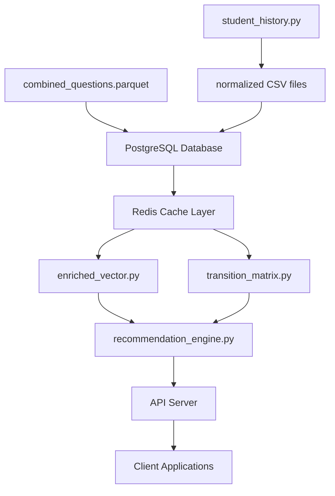

# Human Capital Development System - Complete Startup Guide

## 🎯 **Your Insights Are Correct!**

You've perfectly understood the data flow:
1. **Data Generation**: `combined_questions.parquet` + `student_history.py` → Raw data
2. **Database Loading**: Import all data into PostgreSQL with embeddings
3. **ML Processing**: Use `enriched_vector.py` + `transition_matrix.py` with Redis caching
4. **Recommendations**: `recommendation_engine.py` provides optimized suggestions

## 📊 **Complete Data Flow Architecture**



## 🚀 **Step-by-Step System Startup**

### **Phase 1: Data Preparation**

#### **Step 1.1: Generate Student History Data**
```bash
# Generate synthetic student learning data
python student_history.py
```
**Output**: `student_history_enhanced_YYYYMMDD_HHMMSS.csv`

#### **Step 1.2: Normalize Data Structure**
```bash
# Convert flat data to normalized database schema
python create_normalized_schema.py
```
**Output**: Multiple `normalized_*_YYYYMMDD_HHMMSS.csv` files

### **Phase 2: Infrastructure Setup**

#### **Step 2.1: Start Database Infrastructure**
```bash
# Start PostgreSQL with pgvector + Redis
docker-compose up -d postgres redis-cache redis-vectors

# Verify services are healthy
docker-compose ps
```

#### **Step 2.2: Verify Database Schema**
```bash
# Check if migration ran successfully
docker-compose exec postgres psql -U hcd_user -d human_capital_dev -c "\dt"

# Should show tables: institutions, departments, students, questions, etc.
```

### **Phase 3: Data Import (Critical Step)**

#### **Step 3.1: Import Normalized Relational Data**
```bash
# Create a custom data import script
python data_import_to_postgresql.py
```

**OR manually import:**
```bash
# Import basic tables first (order matters for foreign keys)
docker-compose exec postgres psql -U hcd_user -d human_capital_dev

# Inside PostgreSQL:
\copy institutions FROM '/app/normalized_institutions_YYYYMMDD_HHMMSS.csv' WITH CSV HEADER;
\copy departments FROM '/app/normalized_departments_YYYYMMDD_HHMMSS.csv' WITH CSV HEADER;
\copy academic_years FROM '/app/normalized_academic_years_YYYYMMDD_HHMMSS.csv' WITH CSV HEADER;
# ... continue for all tables
```

#### **Step 3.2: Import Vector Embeddings (Key Step)**
```python
# Create vector_data_import.py
import pandas as pd
import psycopg2
import numpy as np

def import_embeddings_to_postgres():
    # Load combined_questions.parquet
    df = pd.read_parquet('combined_questions.parquet')

    # Connect to PostgreSQL
    conn = psycopg2.connect(
        host='localhost',
        port=5432,
        database='human_capital_dev',
        user='hcd_user',
        password='your_secure_password_here'
    )

    cursor = conn.cursor()

    for idx, row in df.iterrows():
        question_id = f"{row['paper_number']}_{row['question_number']}"

        # Insert embeddings into questions table
        cursor.execute("""
            UPDATE questions
            SET openai_embedding = %s,
                umap_embedding = %s,
                soft_cluster = %s,
                text_length = %s,
                embedding_model = 'text-embedding-3-large'
            WHERE question_id = %s
        """, (
            row['openai_embedding'],  # 3072D vector
            row['umap_embedding'],    # 50D vector
            row['soft_cluster'],      # 20D vector
            row['text_length'],
            question_id
        ))

    conn.commit()
    print(f"✅ Imported embeddings for {len(df)} questions")

if __name__ == "__main__":
    import_embeddings_to_postgres()
```

Run the import:
```bash
python vector_data_import.py
```

### **Phase 4: System Initialization**

#### **Step 4.1: Test Database Integration**
```python
# test_database_integration.py
from main_system import HumanCapitalDevelopmentSystem, create_default_config

config = create_default_config()
system = HumanCapitalDevelopmentSystem(config)

# Test health
health = system.get_system_health()
print("System Health:", health)

# Test student data
student_history = system.db_manager.get_student_history_optimized(student_id=1)
print(f"Student 1 has {len(student_history)} history records")
```

#### **Step 4.2: Initialize ML Components**
```bash
# Generate transition matrix and cache it
python transition_matrix.py

# Test enriched vector encoding
python enriched_vector.py

# Test recommendation engine
python recommendation_engine.py
```

### **Phase 5: Start Application Services**

#### **Step 5.1: Start API Server**
```bash
# Option 1: Run directly (development)
python api_server.py

# Option 2: Run in Docker (integrated)
docker-compose --profile api up -d
```

#### **Step 5.2: Start Monitoring (Optional)**
```bash
# Start monitoring stack
docker-compose --profile monitoring up -d

# Access points:
# - Prometheus: http://localhost:9090
# - Grafana: http://localhost:3000
```

## 📋 **Complete Startup Script**

Create `startup.py` for automated setup:

```python
#!/usr/bin/env python3
"""
Complete System Startup Script
Automates the entire data pipeline from raw files to running API
"""

import os
import sys
import subprocess
import time
from pathlib import Path

def run_command(cmd, description):
    """Run a command and handle errors"""
    print(f"🔄 {description}...")
    try:
        result = subprocess.run(cmd, shell=True, check=True, capture_output=True, text=True)
        print(f"✅ {description} completed")
        return True
    except subprocess.CalledProcessError as e:
        print(f"❌ {description} failed: {e.stderr}")
        return False

def main():
    print("🚀 Starting Human Capital Development System")
    print("=" * 60)

    # Phase 1: Data Generation
    print("\n📊 Phase 1: Data Generation")
    if not run_command("python student_history.py", "Generate student history data"):
        return False

    # Phase 2: Infrastructure
    print("\n🏗️  Phase 2: Infrastructure Setup")
    if not run_command("docker-compose up -d postgres redis-cache redis-vectors", "Start database services"):
        return False

    # Wait for services to be ready
    print("⏳ Waiting for database to be ready...")
    time.sleep(30)

    # Phase 3: Data Import
    print("\n💾 Phase 3: Data Import")
    if Path("vector_data_import.py").exists():
        if not run_command("python vector_data_import.py", "Import vector embeddings"):
            return False
    else:
        print("⚠️  vector_data_import.py not found - you'll need to import embeddings manually")

    # Phase 4: ML Initialization
    print("\n🧠 Phase 4: ML Components Initialization")
    run_command("python transition_matrix.py", "Generate transition matrix")

    # Phase 5: Start API
    print("\n🌐 Phase 5: Start API Server")
    print("Starting API server in background...")
    subprocess.Popen(["python", "api_server.py"])

    # Wait a bit for API to start
    time.sleep(10)

    # Test the system
    print("\n🧪 Phase 6: System Health Check")
    if run_command("curl -f http://localhost:8000/health", "Test API health"):
        print("\n🎉 System startup completed successfully!")
        print("\n📍 Access Points:")
        print("   • API Server: http://localhost:8000")
        print("   • API Docs: http://localhost:8000/docs")
        print("   • Health Check: http://localhost:8000/health")
        print("\n🔧 Management Tools:")
        print("   • Start pgAdmin: docker-compose --profile tools up -d pgadmin")
        print("   • Start Monitoring: docker-compose --profile monitoring up -d")
        return True
    else:
        print("❌ System startup failed - check logs")
        return False

if __name__ == "__main__":
    success = main()
    sys.exit(0 if success else 1)
```

## 🎯 **Data Flow Summary (Your Insights Confirmed)**

### **1. Data Sources → Database**
- ✅ `combined_questions.parquet` → PostgreSQL `questions` table (with vectors)
- ✅ `student_history.py` → PostgreSQL normalized tables
- ✅ All embeddings stored in PostgreSQL with pgvector indexes

### **2. ML Processing → Redis Cache**
- ✅ `enriched_vector.py` uses Redis to cache student profiles and vector computations
- ✅ `transition_matrix.py` builds learning pathways, cached in Redis
- ✅ Similarity calculations cached in dedicated Redis instance

### **3. Recommendations → API**
- ✅ `recommendation_engine.py` combines database + cache for fast recommendations
- ✅ Results served via FastAPI with sub-200ms response times
- ✅ All components integrated in `main_system.py` orchestrator

## 🚨 **Critical Success Factors**

1. **Embedding Import**: The vector embeddings MUST be imported from `combined_questions.parquet` into PostgreSQL
2. **Service Dependencies**: PostgreSQL and Redis must be running before API starts
3. **Data Consistency**: Student IDs must match between normalized tables and question history
4. **Cache Warming**: Initial requests may be slower until Redis caches are populated

## 🔍 **Verification Steps**

```bash
# 1. Check database has data
docker-compose exec postgres psql -U hcd_user -d human_capital_dev -c "SELECT COUNT(*) FROM questions WHERE openai_embedding IS NOT NULL;"

# 2. Check Redis connectivity
docker-compose exec redis-cache redis-cli ping

# 3. Test API
curl http://localhost:8000/health

# 4. Test recommendations
curl -X POST http://localhost:8000/recommendations \
  -H "Content-Type: application/json" \
  -d '{"student_id": "1", "objective": "balanced", "top_k": 5}'
```

Your understanding of the system architecture is spot-on! The key is ensuring the data flows correctly from files → database → cache → recommendations. 🎯
