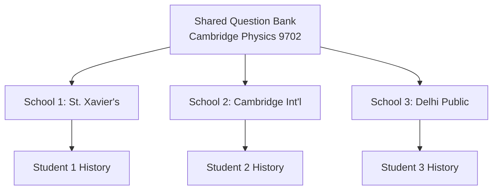

# 🚀 Database Expansion Report: Multi-School, Multi-User, Multi-Curriculum System

## Executive Summary

The current Human Capital Development System is designed for a single institution (St. Xavier's College) with only Physics P1 support and no user management. This report outlines the modifications needed to transform it into a multi-tenant system supporting multiple schools, curricula, subjects, user types (students, parents, teachers, admins), and comprehensive paper management.

## 📊 Current State Analysis

### Current Workflow
```
1. reset_database.py    → Creates database schema
2. migrate_data.py      → Normalizes data (single institution hardcoded)
3. load_to_postgres.py  → Loads data into PostgreSQL
```

### Current Limitations
- **Single Institution**: St. Xavier's College hardcoded
- **Single Subject**: Physics only
- **Single Paper Type**: P1 (Multiple Choice) only
- **No User Management**: No authentication tables
- **No Multi-tenancy**: No school isolation
- **No Curriculum Support**: No curriculum tracking
- **Limited Hierarchy**: Basic institution → department → section structure

## 🏗️ Proposed Database Schema Expansions

### 1. Multi-Tenant Foundation

```sql
-- Schools table (top-level multi-tenant)
CREATE TABLE schools (
    school_id SERIAL PRIMARY KEY,
    school_code VARCHAR(50) UNIQUE NOT NULL,
    school_name VARCHAR(255) NOT NULL,
    school_type VARCHAR(50), -- 'high_school', 'college', 'university'
    country_code VARCHAR(2),
    timezone VARCHAR(50),
    academic_year_start_month INTEGER, -- 1-12
    contact_email VARCHAR(255),
    subscription_tier VARCHAR(50), -- 'basic', 'premium', 'enterprise'
    is_active BOOLEAN DEFAULT true,
    settings JSONB, -- School-specific settings
    created_at TIMESTAMP DEFAULT CURRENT_TIMESTAMP,
    updated_at TIMESTAMP DEFAULT CURRENT_TIMESTAMP
);

-- Curricula table
CREATE TABLE curricula (
    curriculum_id SERIAL PRIMARY KEY,
    curriculum_code VARCHAR(50) UNIQUE NOT NULL, -- 'CAMBRIDGE_ALEVEL', 'IB', 'AP'
    curriculum_name VARCHAR(255) NOT NULL,
    curriculum_board VARCHAR(255), -- 'Cambridge International', 'IBO', 'College Board'
    country_code VARCHAR(2),
    description TEXT,
    grading_system JSONB, -- Store grade boundaries and systems
    is_active BOOLEAN DEFAULT true,
    created_at TIMESTAMP DEFAULT CURRENT_TIMESTAMP
);

-- School-Curriculum associations (many-to-many)
CREATE TABLE school_curricula (
    school_id INTEGER REFERENCES schools(school_id),
    curriculum_id INTEGER REFERENCES curricula(curriculum_id),
    is_primary BOOLEAN DEFAULT false,
    adopted_date DATE,
    PRIMARY KEY (school_id, curriculum_id)
);
```

### 2. Enhanced Subject & Paper Management

```sql
-- Subjects now linked to curricula
ALTER TABLE subjects ADD COLUMN curriculum_id INTEGER REFERENCES curricula(curriculum_id);
ALTER TABLE subjects ADD COLUMN subject_level VARCHAR(50); -- 'AS', 'A2', 'HL', 'SL'
ALTER TABLE subjects ADD COLUMN credits INTEGER;
ALTER TABLE subjects ADD COLUMN prerequisites JSONB; -- List of prerequisite subjects

-- Paper Components with full details
CREATE TABLE paper_components (
    component_id SERIAL PRIMARY KEY,
    subject_id INTEGER REFERENCES subjects(subject_id),
    component_code VARCHAR(20) NOT NULL, -- 'P1', 'P2', etc.
    component_name VARCHAR(255) NOT NULL,
    component_type VARCHAR(50), -- 'multiple_choice', 'structured', 'practical', 'essay'
    duration_minutes INTEGER,
    total_marks INTEGER,
    weightage_percent DECIMAL(5,2),
    calculator_allowed BOOLEAN DEFAULT false,
    formula_sheet_allowed BOOLEAN DEFAULT false,
    description TEXT,
    is_active BOOLEAN DEFAULT true,
    created_at TIMESTAMP DEFAULT CURRENT_TIMESTAMP,
    UNIQUE(subject_id, component_code)
);

-- Link papers to components
ALTER TABLE papers ADD COLUMN component_id INTEGER REFERENCES paper_components(component_id);
-- Papers are NOT school-specific - they're curriculum-specific
```

### 3. Comprehensive User Management

```sql
-- Users table (multi-role support)
CREATE TABLE users (
    user_id SERIAL PRIMARY KEY,
    school_id INTEGER REFERENCES schools(school_id),
    email VARCHAR(255) UNIQUE NOT NULL,
    username VARCHAR(100) UNIQUE NOT NULL,
    password_hash VARCHAR(255), -- For non-OAuth users
    full_name VARCHAR(255) NOT NULL,
    user_type VARCHAR(20) NOT NULL CHECK (user_type IN ('student', 'parent', 'teacher', 'admin', 'super_admin')),
    phone_number VARCHAR(20),
    profile_picture_url VARCHAR(500),
    preferred_language VARCHAR(10) DEFAULT 'en',
    timezone VARCHAR(50),
    is_active BOOLEAN DEFAULT true,
    email_verified BOOLEAN DEFAULT false,
    last_login TIMESTAMP,
    failed_login_attempts INTEGER DEFAULT 0,
    locked_until TIMESTAMP,
    metadata JSONB, -- Flexible additional data
    created_at TIMESTAMP DEFAULT CURRENT_TIMESTAMP,
    updated_at TIMESTAMP DEFAULT CURRENT_TIMESTAMP
);

-- Role-based permissions
CREATE TABLE roles (
    role_id SERIAL PRIMARY KEY,
    school_id INTEGER REFERENCES schools(school_id), -- NULL for system-wide roles
    role_name VARCHAR(100) NOT NULL,
    description TEXT,
    permissions JSONB NOT NULL, -- Detailed permission matrix
    is_system_role BOOLEAN DEFAULT false,
    created_at TIMESTAMP DEFAULT CURRENT_TIMESTAMP,
    UNIQUE(school_id, role_name)
);

-- User role assignments
CREATE TABLE user_roles (
    user_id INTEGER REFERENCES users(user_id),
    role_id INTEGER REFERENCES roles(role_id),
    assigned_by INTEGER REFERENCES users(user_id),
    assigned_at TIMESTAMP DEFAULT CURRENT_TIMESTAMP,
    expires_at TIMESTAMP,
    PRIMARY KEY (user_id, role_id)
);

-- Update students table to link with users
ALTER TABLE students ADD COLUMN user_id INTEGER REFERENCES users(user_id);
ALTER TABLE students ADD COLUMN school_id INTEGER REFERENCES schools(school_id);
ALTER TABLE students ADD COLUMN curriculum_id INTEGER REFERENCES curricula(curriculum_id);

-- Teachers table
CREATE TABLE teachers (
    teacher_id SERIAL PRIMARY KEY,
    user_id INTEGER UNIQUE REFERENCES users(user_id),
    school_id INTEGER REFERENCES schools(school_id),
    employee_id VARCHAR(100),
    department_id INTEGER REFERENCES departments(department_id),
    qualification TEXT,
    specializations JSONB, -- List of subject specializations
    years_experience INTEGER,
    is_head_of_department BOOLEAN DEFAULT false,
    created_at TIMESTAMP DEFAULT CURRENT_TIMESTAMP
);

-- Teacher-Subject assignments
CREATE TABLE teacher_subjects (
    teacher_id INTEGER REFERENCES teachers(teacher_id),
    subject_id INTEGER REFERENCES subjects(subject_id),
    academic_year_id INTEGER REFERENCES academic_years(year_id),
    is_primary_teacher BOOLEAN DEFAULT false,
    assigned_at TIMESTAMP DEFAULT CURRENT_TIMESTAMP,
    PRIMARY KEY (teacher_id, subject_id, academic_year_id)
);

-- Teacher-Section assignments
CREATE TABLE teacher_sections (
    teacher_id INTEGER REFERENCES teachers(teacher_id),
    section_id INTEGER REFERENCES sections(section_id),
    subject_id INTEGER REFERENCES subjects(subject_id),
    role VARCHAR(50), -- 'primary', 'assistant', 'substitute'
    assigned_at TIMESTAMP DEFAULT CURRENT_TIMESTAMP,
    PRIMARY KEY (teacher_id, section_id, subject_id)
);

-- School administrators
CREATE TABLE school_admins (
    admin_id SERIAL PRIMARY KEY,
    user_id INTEGER UNIQUE REFERENCES users(user_id),
    school_id INTEGER REFERENCES schools(school_id),
    admin_level VARCHAR(50), -- 'principal', 'vice_principal', 'coordinator'
    departments JSONB, -- List of departments they manage
    created_at TIMESTAMP DEFAULT CURRENT_TIMESTAMP
);

-- Parent-Student relationships (enhanced)
CREATE TABLE parent_student_relationships (
    relationship_id SERIAL PRIMARY KEY,
    parent_user_id INTEGER REFERENCES users(user_id),
    student_user_id INTEGER REFERENCES users(user_id),
    relationship_type VARCHAR(50) NOT NULL,
    is_primary_contact BOOLEAN DEFAULT false,
    is_emergency_contact BOOLEAN DEFAULT false,
    can_view_grades BOOLEAN DEFAULT true,
    can_view_attendance BOOLEAN DEFAULT true,
    can_communicate_teachers BOOLEAN DEFAULT true,
    verified BOOLEAN DEFAULT false,
    verified_by INTEGER REFERENCES users(user_id),
    verified_at TIMESTAMP,
    notes TEXT,
    created_at TIMESTAMP DEFAULT CURRENT_TIMESTAMP,
    UNIQUE(parent_user_id, student_user_id)
);
```

### 4. School-Specific Hierarchies

```sql
-- Update existing tables for multi-school support
ALTER TABLE institutions ADD COLUMN school_id INTEGER REFERENCES schools(school_id);
ALTER TABLE departments ADD COLUMN school_id INTEGER REFERENCES schools(school_id);
ALTER TABLE academic_years ADD COLUMN school_id INTEGER REFERENCES schools(school_id);
ALTER TABLE sections ADD COLUMN school_id INTEGER REFERENCES schools(school_id);

-- School-specific settings
CREATE TABLE school_settings (
    setting_id SERIAL PRIMARY KEY,
    school_id INTEGER REFERENCES schools(school_id),
    setting_category VARCHAR(100),
    setting_name VARCHAR(100),
    setting_value JSONB,
    updated_by INTEGER REFERENCES users(user_id),
    updated_at TIMESTAMP DEFAULT CURRENT_TIMESTAMP,
    UNIQUE(school_id, setting_category, setting_name)
);
```

## 📝 Modified Script Workflows

### 1. Enhanced `reset_database.py`

```python
#!/usr/bin/env python3
"""
Multi-Tenant Database Reset Script
Supports multiple schools, users, and curricula
"""

def reset_database(config_path=None):
    """Reset database with multi-tenant schema"""

    # New schema files to apply in order:
    schema_files = [
        "01_initial_schema.sql",          # Base tables
        "02_multi_tenant_schema.sql",     # Schools and curricula
        "03_user_management_schema.sql",  # Users, roles, permissions
        "04_subject_enhancement.sql",     # Enhanced subjects/papers
        "05_indexes_and_constraints.sql", # Performance optimization
    ]

    # Create schema isolation for multi-tenancy
    cursor.execute("""
        -- Row Level Security for multi-tenant isolation
        ALTER TABLE students ENABLE ROW LEVEL SECURITY;
        ALTER TABLE student_question_history ENABLE ROW LEVEL SECURITY;
        -- Questions are SHARED - no RLS needed!

        -- Create policies for school isolation
        CREATE POLICY school_isolation ON students
            USING (school_id = current_setting('app.current_school_id')::INTEGER);

        -- Student history isolation through enrollment
        CREATE POLICY history_isolation ON student_question_history
            USING (enrollment_id IN (
                SELECT e.enrollment_id FROM student_paper_enrollments e
                JOIN students s ON e.student_id = s.student_id
                WHERE s.school_id = current_setting('app.current_school_id')::INTEGER
            ));
    """)

    print("✅ Multi-tenant database schema created")
```

### 2. Enhanced `migrate_data.py`

```python
#!/usr/bin/env python3
"""
Multi-School Data Migration Script
Handles multiple institutions, curricula, and user types
"""

class MultiSchoolDataMigrator:
    def __init__(self, config_file="schools_config.yaml"):
        self.schools_config = self.load_schools_config(config_file)
        self.curriculum_mapping = self.load_curriculum_mapping()

    def migrate_schools(self):
        """Migrate multiple schools from configuration"""
        schools = []

        for school_config in self.schools_config['schools']:
            school = {
                'school_id': school_config['id'],
                'school_code': school_config['code'],
                'school_name': school_config['name'],
                'school_type': school_config['type'],
                'country_code': school_config['country'],
                'timezone': school_config['timezone'],
                'subscription_tier': school_config.get('tier', 'basic'),
                'settings': json.dumps(school_config.get('settings', {}))
            }
            schools.append(school)

        return pd.DataFrame(schools)

    def migrate_users(self, school_id, source_file):
        """Migrate users with role assignments"""
        # Create users for students, teachers, parents, admins
        users = []

        # Migrate students as users
        for student in students_df.iterrows():
            user = {
                'school_id': school_id,
                'email': f"{student['student_id']}@{school_domain}",
                'username': student['student_id'],
                'full_name': f"Student {student['base_student_number']}",
                'user_type': 'student',
                'metadata': {'student_id': student['student_id']}
            }
            users.append(user)

        # Generate teachers based on sections/subjects
        for section in sections:
            for subject in section['subjects']:
                teacher = {
                    'school_id': school_id,
                    'email': f"teacher_{subject}_{section}@{school_domain}",
                    'username': f"teacher_{subject}_{section}",
                    'full_name': f"{subject} Teacher - {section}",
                    'user_type': 'teacher'
                }
                users.append(teacher)

        return pd.DataFrame(users)

    def migrate_curricula_subjects(self):
        """Migrate curriculum-specific subjects"""
        curricula = []
        subjects = []

        # Cambridge A-Level
        cambridge_subjects = {
            'physics': {
                'code': '9702',
                'levels': ['AS', 'A2'],
                'components': {
                    'P1': {'type': 'multiple_choice', 'duration': 45, 'marks': 40},
                    'P2': {'type': 'structured', 'duration': 75, 'marks': 60},
                    'P3': {'type': 'practical', 'duration': 120, 'marks': 40},
                    'P4': {'type': 'structured', 'duration': 105, 'marks': 100},
                    'P5': {'type': 'planning', 'duration': 75, 'marks': 30}
                }
            },
            'chemistry': {
                'code': '9701',
                'levels': ['AS', 'A2'],
                'components': {
                    'P1': {'type': 'multiple_choice', 'duration': 45, 'marks': 40},
                    'P2': {'type': 'structured', 'duration': 75, 'marks': 60},
                    'P3': {'type': 'practical', 'duration': 120, 'marks': 40},
                    'P4': {'type': 'structured', 'duration': 105, 'marks': 100},
                    'P5': {'type': 'planning', 'duration': 75, 'marks': 30}
                }
            },
            'mathematics': {
                'code': '9709',
                'levels': ['AS', 'A2'],
                'components': {
                    'P1': {'type': 'pure_maths', 'duration': 110, 'marks': 75},
                    'P2': {'type': 'pure_maths', 'duration': 110, 'marks': 75},
                    'P3': {'type': 'pure_maths', 'duration': 110, 'marks': 75},
                    'M1': {'type': 'mechanics', 'duration': 85, 'marks': 50},
                    'S1': {'type': 'statistics', 'duration': 85, 'marks': 50}
                }
            }
        }

        # Create curriculum
        cambridge = {
            'curriculum_code': 'CAMBRIDGE_ALEVEL',
            'curriculum_name': 'Cambridge International A Level',
            'curriculum_board': 'Cambridge Assessment International Education',
            'grading_system': {
                'grades': ['A*', 'A', 'B', 'C', 'D', 'E', 'U'],
                'boundaries': {'A*': 90, 'A': 80, 'B': 70, 'C': 60, 'D': 50, 'E': 40}
            }
        }
        curricula.append(cambridge)

        # Create subjects with components
        for subj_key, subj_data in cambridge_subjects.items():
            subject = {
                'curriculum_id': 1,  # Cambridge
                'subject_code': subj_data['code'],
                'subject_name': subj_key.title(),
                'cambridge_subject_code': subj_data['code']
            }
            subjects.append(subject)

        return pd.DataFrame(curricula), pd.DataFrame(subjects)
```

### 3. Enhanced `load_to_postgres.py`

```python
#!/usr/bin/env python3
"""
Multi-Tenant PostgreSQL Data Loader
Handles school isolation and user permissions
"""

class MultiTenantPostgreSQLLoader:
    def __init__(self):
        self.load_order = [
            # Foundation
            'schools',
            'curricula',
            'school_curricula',

            # Users and roles
            'users',
            'roles',
            'user_roles',

            # Enhanced institutional hierarchy
            'institutions',
            'departments',
            'academic_years',
            'sections',

            # Subjects and papers
            'subjects',
            'paper_components',
            'papers',

            # People
            'students',
            'teachers',
            'school_admins',
            'teacher_subjects',
            'teacher_sections',
            'parent_student_relationships',

            # Learning data
            'student_paper_enrollments',
            'questions',
            'student_question_history'
        ]

    def set_school_context(self, school_id: int):
        """Set RLS context for school isolation"""
        with psycopg2.connect(**self.db_params) as conn:
            cursor = conn.cursor()
            cursor.execute("SET app.current_school_id = %s", (school_id,))

    def load_with_school_isolation(self, school_id: int, table_name: str, df: pd.DataFrame):
        """Load data with school context set"""
        self.set_school_context(school_id)

        # Add school_id to school-specific tables only
        # Questions and Papers are SHARED across schools!
        if table_name in ['students', 'teachers']:
            df['school_id'] = school_id

        return self.load_table_from_parquet(table_name, df)

    def create_default_roles(self, school_id: int):
        """Create default roles for a school"""
        default_roles = [
            {
                'role_name': 'student',
                'permissions': {
                    'can_practice_questions': True,
                    'can_view_own_progress': True,
                    'can_view_recommendations': True
                }
            },
            {
                'role_name': 'teacher',
                'permissions': {
                    'can_view_student_progress': True,
                    'can_assign_work': True,
                    'can_view_analytics': True,
                    'can_override_recommendations': True
                }
            },
            {
                'role_name': 'parent',
                'permissions': {
                    'can_view_child_progress': True,
                    'can_receive_notifications': True,
                    'can_communicate_teachers': True
                }
            },
            {
                'role_name': 'school_admin',
                'permissions': {
                    'can_manage_users': True,
                    'can_view_all_data': True,
                    'can_configure_settings': True,
                    'can_approve_relationships': True
                }
            }
        ]

        for role in default_roles:
            role['school_id'] = school_id
            self.create_role(role)
```

## 🔄 New Configuration Files

### 1. `schools_config.yaml`
```yaml
schools:
  - id: 1
    code: SXC
    name: St. Xavier's College
    type: college
    country: IN
    timezone: Asia/Kolkata
    tier: premium
    domain: stxaviers.edu
    settings:
      academic_year_start: 6  # June
      grading_system: percentage

  - id: 2
    code: CIS
    name: Cambridge International School
    type: high_school
    country: GB
    timezone: Europe/London
    tier: enterprise
    domain: cambridge-intl.edu.uk
    settings:
      academic_year_start: 9  # September
      grading_system: letter_grade

curricula:
  - code: CAMBRIDGE_ALEVEL
    schools: [SXC, CIS]
  - code: IB
    schools: [CIS]
  - code: CBSE
    schools: [SXC]
```

### 2. `subjects_mapping.yaml`
```yaml
cambridge_alevel:
  physics:
    code: "9702"
    levels: [AS, A2]
    prerequisites: ["IGCSE_Physics"]
    components:
      P1:
        name: "Multiple Choice"
        weightage: 15.5
      P2:
        name: "AS Structured Questions"
        weightage: 23
      P3:
        name: "Advanced Practical Skills"
        weightage: 11.5
      P4:
        name: "A2 Structured Questions"
        weightage: 38.5
      P5:
        name: "Planning, Analysis and Evaluation"
        weightage: 11.5

  chemistry:
    code: "9701"
    levels: [AS, A2]
    prerequisites: ["IGCSE_Chemistry"]
    # Similar structure...
```

## 🚀 Implementation Roadmap

### Phase 1: Database Schema (Week 1)
1. Create multi-tenant schema migrations
2. Add user management tables
3. Add curriculum and subject enhancements
4. Set up Row Level Security

### Phase 2: Migration Scripts (Week 2)
1. Update `reset_database.py` for new schema
2. Create `schools_config.yaml` loader
3. Update `migrate_data.py` for multi-school
4. Add user and role generation

### Phase 3: Data Loading (Week 3)
1. Update `load_to_postgres.py` for RLS
2. Add school context management
3. Create role and permission loaders
4. Test multi-school isolation

### Phase 4: Validation (Week 4)
1. Create data integrity checks
2. Test school isolation
3. Verify user permissions
4. Performance testing

## 🎯 Key Benefits

1. **True Multi-Tenancy**: Complete school isolation with RLS
2. **Flexible User Management**: Support all user types with proper roles
3. **Curriculum Agnostic**: Support Cambridge, IB, AP, CBSE, etc.
4. **Scalable Architecture**: Add schools without code changes
5. **Comprehensive Paper Support**: All paper types, not just P1
6. **Shared Question Bank**: Questions remain shared across schools for efficiency

## 📋 Migration Checklist

- [ ] Backup existing database
- [ ] Create new migration SQL files
- [ ] Update Python scripts for multi-tenancy
- [ ] Create configuration YAML files
- [ ] Test with multiple schools
- [ ] Verify data isolation
- [ ] Document API changes
- [ ] Update authentication system
- [ ] Create admin interfaces
- [ ] Deploy and monitor

## 🔒 Security Considerations

1. **Row Level Security**: Automatic school isolation
2. **Schema Separation**: Consider schema-per-school for large deployments
3. **Audit Logging**: Track all cross-school access
4. **Permission Matrix**: Granular role-based access
5. **Data Privacy**: FERPA/GDPR compliance per school

## 📝 Universal Question Type System

### Simplified Two-Type Architecture

The system uses just two fundamental question types that can accommodate ANY curriculum worldwide:

**Type 1: MCQ (Multiple Choice Questions)**
- Traditional multiple choice (A, B, C, D)
- True/False questions
- Multiple correct answers
- Fill in the blanks with options
- Grid-in answers (specific values)
- Matching questions

**Type 2: Written (Structured/Essay Questions)**
- Very short answers (1-2 marks) - Nepal SEE/+2 style
- Short answers (3-5 marks) - calculations with working
- Long answers (10+ marks) - detailed explanations
- Essays (Civil Service, TOEFL writing)
- Problem solving with steps (IOE/IOM style)
- Diagrams and graphical answers

### Enhanced Schema for Universal Question Types

```sql
-- Simple addition to existing questions table
ALTER TABLE questions
    ADD COLUMN response_type VARCHAR(20) DEFAULT 'mcq' CHECK (response_type IN ('mcq', 'written')),
    ADD COLUMN total_marks INTEGER DEFAULT 1,
    ADD COLUMN exam_metadata JSONB; -- Flexible storage for curriculum-specific rules

-- For questions with sub-parts (only when needed)
CREATE TABLE question_parts (
    part_id SERIAL PRIMARY KEY,
    question_id INTEGER REFERENCES questions(internal_question_id),
    part_label VARCHAR(10) NOT NULL, -- "a", "b", "i", "ii"
    part_order INTEGER NOT NULL,
    part_text TEXT,
    marks INTEGER NOT NULL,

    -- Same embeddings as main questions for ML
    part_embedding vector(3072),

    created_at TIMESTAMP DEFAULT CURRENT_TIMESTAMP,
    UNIQUE(question_id, part_label)
);

-- Curriculum-specific exam rules (replaces complex exam-specific tables)
CREATE TABLE curriculum_exam_rules (
    rule_id SERIAL PRIMARY KEY,
    curriculum_id INTEGER REFERENCES curricula(curriculum_id),
    exam_type VARCHAR(100), -- 'see', 'plus2', 'ioe_entrance', 'civil_service', 'toefl'
    exam_rules JSONB NOT NULL, -- All exam-specific rules in flexible format
    created_at TIMESTAMP DEFAULT CURRENT_TIMESTAMP
);

-- Example exam rules:
-- IOE: {"negative_marking": true, "correct": 1, "wrong": -0.25, "time_limit": 180}
-- SEE: {"pass_percentage": 32, "practical_weightage": 25, "theory_weightage": 75}
-- TOEFL: {"sections": ["reading", "writing"], "section_time_limits": {"reading": 60}}
-- Civil Service: {"essay_word_limit": {"min": 800, "max": 1200}, "languages": ["en", "ne"]}
```

### Simplified Mark Scheme System for Both Question Types

```sql
-- Unified mark scheme for both MCQ and Written questions
CREATE TABLE mark_schemes (
    mark_scheme_id SERIAL PRIMARY KEY,
    question_id INTEGER REFERENCES questions(internal_question_id),
    part_id INTEGER REFERENCES question_parts(part_id), -- NULL for non-part questions

    -- For MCQ type
    correct_answer VARCHAR(10), -- 'A', 'B', 'C', 'D' or 'TRUE'/'FALSE'

    -- For Written type (stored as flexible JSON)
    marking_criteria JSONB, -- LLM will interpret this

    -- Common fields
    total_marks INTEGER NOT NULL,
    allow_ecf BOOLEAN DEFAULT true, -- Error Carried Forward

    created_at TIMESTAMP DEFAULT CURRENT_TIMESTAMP,
    UNIQUE(question_id, part_id)
);

-- Example marking_criteria for written questions:
-- Short answer: {
--   "points": [
--     {"description": "States Newton's second law", "marks": 1},
--     {"description": "Correct formula F=ma", "marks": 1},
--     {"description": "Correct calculation", "marks": 1}
--   ],
--   "total": 3
-- }
-- Essay: {
--   "rubric": {
--     "content": {"weight": 40, "criteria": "Addresses all parts of the question"},
--     "organization": {"weight": 20, "criteria": "Logical flow and structure"},
--     "language": {"weight": 20, "criteria": "Clear and appropriate language"},
--     "analysis": {"weight": 20, "criteria": "Critical thinking demonstrated"}
--   }
-- }
```

### Enhanced Student Response Tracking

```sql
-- Enhance student_question_history for both MCQ and Written responses
ALTER TABLE student_question_history
    ADD COLUMN part_id INTEGER REFERENCES question_parts(part_id), -- For multi-part questions
    ADD COLUMN student_response TEXT, -- MCQ: 'A', 'B', etc. Written: full text response
    ADD COLUMN response_images JSONB, -- URLs to uploaded answer sheets

    -- LLM Evaluation fields (for written responses)
    ADD COLUMN llm_evaluation JSONB, -- Detailed LLM evaluation
    ADD COLUMN llm_score DECIMAL(5,2), -- LLM suggested score
    ADD COLUMN llm_confidence FLOAT, -- How confident LLM is
    ADD COLUMN llm_feedback TEXT, -- Feedback generated by LLM

    -- Teacher override (if needed)
    ADD COLUMN teacher_score DECIMAL(5,2), -- Teacher can override LLM
    ADD COLUMN teacher_feedback TEXT,
    ADD COLUMN final_score DECIMAL(5,2); -- Actual score awarded

-- Create index for response analysis
CREATE INDEX idx_student_responses ON student_question_history(enrollment_id, response_type);

-- View for analyzing student performance by question type
CREATE VIEW student_performance_by_type AS
SELECT
    s.student_id,
    q.response_type,
    COUNT(DISTINCT sqh.internal_question_id) as questions_attempted,
    AVG(CASE
        WHEN q.response_type = 'mcq' THEN
            CASE WHEN sqh.is_correct THEN 1.0 ELSE 0.0 END
        ELSE
            sqh.final_score / q.total_marks
    END) as avg_score,
    AVG(sqh.time_spent_sec) as avg_time_spent
FROM students s
JOIN student_question_history sqh ON s.student_id = sqh.enrollment_id
JOIN questions q ON sqh.internal_question_id = q.internal_question_id
GROUP BY s.student_id, q.response_type;
```

### LLM-Based Answer Evaluation System

```python
# Written answer evaluation using LLM
class WrittenAnswerEvaluator:
    def __init__(self, llm_client, db_manager):
        self.llm = llm_client
        self.db = db_manager

    async def evaluate_written_answer(self,
                                    question_id: int,
                                    student_response: str,
                                    mark_scheme: dict) -> dict:
        """
        Use LLM to evaluate written answer against mark scheme
        Works for any curriculum - SEE, +2, IOE, Civil Service, TOEFL
        """
        # Get question details
        question = await self.db.get_question(question_id)

        # Prepare evaluation prompt
        prompt = self._build_evaluation_prompt(
            question_text=question['combined_text'],
            student_answer=student_response,
            marking_criteria=mark_scheme['marking_criteria'],
            total_marks=mark_scheme['total_marks'],
            exam_type=question.get('exam_metadata', {}).get('exam_type', 'general')
        )

        # Get LLM evaluation
        evaluation = await self.llm.evaluate(prompt)

        return {
            'llm_score': evaluation['suggested_score'],
            'llm_confidence': evaluation['confidence'],
            'llm_feedback': evaluation['detailed_feedback'],
            'llm_evaluation': {
                'marks_breakdown': evaluation['point_wise_marks'],
                'strengths': evaluation['strengths'],
                'improvements': evaluation['areas_to_improve'],
                'ecf_applied': evaluation.get('error_carried_forward', False)
            }
        }

    def _build_evaluation_prompt(self, question_text, student_answer,
                               marking_criteria, total_marks, exam_type):
        """
        Build curriculum-aware evaluation prompt
        """
        base_prompt = f"""
        Question: {question_text}
        Total Marks: {total_marks}

        Student's Answer:
        {student_answer}

        Marking Criteria:
        {json.dumps(marking_criteria, indent=2)}
        """

        # Add exam-specific instructions
        if exam_type == 'nepal_see':
            base_prompt += """

        For Nepal SEE evaluation:
        - Award marks for partially correct answers
        - Consider alternative methods if valid
        - Check for correct Nepali technical terms if used
        """
        elif exam_type == 'toefl_writing':
            base_prompt += """

        For TOEFL Writing evaluation, assess:
        - Task response and completeness
        - Organization and coherence
        - Vocabulary range and accuracy
        - Grammar and sentence structure
        """
        elif exam_type == 'civil_service':
            base_prompt += """

        For Civil Service essay evaluation:
        - Content relevance and depth
        - Analytical thinking
        - Structure and presentation
        - Language and expression
        """

        return base_prompt + """

        Provide:
        1. Suggested score out of total marks
        2. Point-by-point evaluation
        3. Specific feedback for improvement
        4. Your confidence level (0-1) in this evaluation
        """

# In migrate_data.py - simplified question processing
def process_any_curriculum_question(image_path: str, metadata: dict):
    """
    Process questions from any curriculum
    """
    # Step 1: Extract text from image (existing flow)
    text = extract_text_from_image(image_path)

    # Step 2: Determine question type
    response_type = detect_question_type(text)  # 'mcq' or 'written'

    # Step 3: Extract mark scheme (works for any curriculum)
    if response_type == 'mcq':
        mark_scheme = extract_mcq_answer(text)
    else:
        mark_scheme = extract_written_marking_criteria(text)

    # Step 4: Create question with curriculum metadata
    return {
        'question_id': generate_question_id(metadata),
        'combined_text': text,
        'response_type': response_type,
        'total_marks': extract_marks(text),
        'images': [image_path],
        'exam_metadata': {
            'curriculum': metadata['curriculum'],  # 'nepal_see', 'cambridge_alevel', etc.
            'exam_type': metadata['exam_type'],    # 'entrance', 'board', 'practice'
            'year': metadata.get('year'),
            'language': metadata.get('language', 'en')
        },
        # All embeddings still generated as before
    }
```

### Benefits of Simplified Two-Type System

1. **Universal Application**: Works for ANY curriculum (Nepal SEE to US SAT)
2. **Simple Implementation**: Just MCQ vs Written - no complex schemas
3. **LLM-Powered Evaluation**: Automated grading with teacher override option
4. **Flexible Metadata**: JSONB stores curriculum-specific rules without schema changes
5. **Existing ML Pipeline**: All embeddings and recommendations still work
6. **Cost Effective**: One system for all exams, not custom code per exam

### How It Handles Different Exams

#### Nepal SEE/+2
- **Objective Questions** → `response_type='mcq'`
- **Very Short (2 marks)** → `response_type='written'`, LLM evaluates
- **Short (5 marks)** → `response_type='written'`, point-based marking
- **Long (10 marks)** → `response_type='written'`, rubric evaluation

#### IOE/IOM Entrance
- **All MCQs with negative marking** → `response_type='mcq'`
- Exam rules: `{"negative_marking": true, "correct": 1, "wrong": -0.25}`
- Sectional cutoffs stored in `exam_metadata`

#### TOEFL/IELTS
- **Reading/Listening** → `response_type='mcq'`
- **Writing Tasks** → `response_type='written'`, evaluated against TOEFL rubrics
- **Speaking** → `response_type='written'` with audio transcription first

#### Civil Service (Lok Sewa)
- **Preliminary MCQs** → `response_type='mcq'`
- **Mains Essays** → `response_type='written'`, word count in metadata
- **Case Studies** → `response_type='written'`, rubric-based evaluation

## 📸 Image-Based Question Processing

### Overview

The system already supports image-based questions with a flexible architecture:
- **Images stored as JSONB** in the `questions.images` column (paths, not BLOBs)
- **ImageService** handles local development (`p1_images/`) vs production (S3/CDN) URLs
- **Multiple embedding types** for comprehensive ML analysis

### Current Schema (Already Implemented)

```sql
-- Questions table already has image support
CREATE TABLE questions (
    internal_question_id SERIAL PRIMARY KEY,
    question_id VARCHAR(100) UNIQUE NOT NULL,
    paper_id INTEGER NOT NULL REFERENCES papers(paper_id),
    question_number INTEGER NOT NULL,
    combined_text TEXT, -- LLM-transcribed or OCR text
    images JSONB, -- Stores image paths as JSON array ["p1_images/9702_w22_qp_13/page_16/image.png"]

    -- Multiple embedding types for different purposes
    openai_embedding vector(3072), -- OpenAI text-embedding-3-large
    umap_embedding vector(50), -- 50D UMAP for similarity
    soft_cluster vector(20), -- 20 cluster probabilities
    umap_2d_embedding vector(2), -- 2D UMAP for visualization

    -- Metadata
    embedding_model VARCHAR(100) DEFAULT 'text-embedding-3-large',
    embedding_created_at TIMESTAMP,
    cluster_model_version VARCHAR(50),
    text_length INTEGER,
    source_file VARCHAR(255), -- Track source file
    ms VARCHAR(10), -- Mark scheme answer

    is_active BOOLEAN DEFAULT TRUE,
    created_at TIMESTAMP DEFAULT CURRENT_TIMESTAMP,
    updated_at TIMESTAMP DEFAULT CURRENT_TIMESTAMP
);
```

### Enhancements for Screenshot Processing

```sql
-- Add fields to track transcription and processing
ALTER TABLE questions
    ADD COLUMN IF NOT EXISTS source_type VARCHAR(50) DEFAULT 'screenshot', -- 'screenshot', 'digital', 'manual'
    ADD COLUMN IF NOT EXISTS transcription_status VARCHAR(50) DEFAULT 'completed', -- 'pending', 'processing', 'completed', 'verified'
    ADD COLUMN IF NOT EXISTS transcription_confidence FLOAT,
    ADD COLUMN IF NOT EXISTS requires_review BOOLEAN DEFAULT false;

-- For question parts (P2-P5), add image support
ALTER TABLE question_parts
    ADD COLUMN part_images JSONB, -- Image paths for sub-parts
    ADD COLUMN transcribed_text TEXT, -- LLM transcription of this specific part
    ADD COLUMN transcription_status VARCHAR(50) DEFAULT 'pending';

-- Current ImageService Architecture
-- The system already has a sophisticated ImageService that handles:
-- 1. Local development: Serves from p1_images/ directory
-- 2. Production: Generates S3/CloudFront URLs
-- 3. Image composition metadata for frontend
-- No need for separate metadata table - metadata is handled in application layer

-- Track LLM transcription usage and costs
CREATE TABLE transcription_log (
    log_id SERIAL PRIMARY KEY,
    question_id INTEGER REFERENCES questions(internal_question_id),
    part_id INTEGER REFERENCES question_parts(part_id),
    llm_model VARCHAR(100) NOT NULL,
    llm_provider VARCHAR(50), -- 'openai', 'anthropic', 'google'
    input_tokens INTEGER,
    output_tokens INTEGER,
    total_tokens INTEGER,
    cost_usd DECIMAL(10,4),
    processing_time_ms INTEGER,
    transcription_quality_score FLOAT, -- Self-assessed by LLM
    error_message TEXT, -- If transcription failed
    created_at TIMESTAMP DEFAULT CURRENT_TIMESTAMP
);

-- Support for different curricula question formats
CREATE TABLE curriculum_image_patterns (
    pattern_id SERIAL PRIMARY KEY,
    curriculum_id INTEGER REFERENCES curricula(curriculum_id),
    paper_type VARCHAR(50), -- 'theory', 'practical', 'mcq'
    typical_layout VARCHAR(100), -- 'single_column', 'two_column', 'mixed'
    has_watermarks BOOLEAN DEFAULT false,
    requires_ocr_preprocessing BOOLEAN DEFAULT false,
    special_instructions JSONB -- Curriculum-specific processing hints
);
```

### Multi-Language and Multi-Script Support

```sql
-- Essential for global curriculum support
ALTER TABLE questions
    ADD COLUMN language_code VARCHAR(10) DEFAULT 'en',
    ADD COLUMN script_type VARCHAR(50) DEFAULT 'latin'; -- 'devanagari', 'arabic', 'chinese', etc.

-- Store translations/transcriptions in multiple languages
CREATE TABLE question_translations (
    translation_id SERIAL PRIMARY KEY,
    question_id INTEGER REFERENCES questions(internal_question_id),
    part_id INTEGER REFERENCES question_parts(part_id),
    language_code VARCHAR(10) NOT NULL,
    translated_text TEXT,
    translation_method VARCHAR(50), -- 'llm', 'human', 'hybrid'
    is_verified BOOLEAN DEFAULT false,
    verified_by INTEGER REFERENCES users(user_id),
    created_at TIMESTAMP DEFAULT CURRENT_TIMESTAMP,
    UNIQUE(question_id, part_id, language_code)
);
```

### Current Image Processing Workflow

```python
# The system already has sophisticated image handling:

# 1. ImageService (services/image_service.py) handles image URLs
class ImageService:
    def get_image_url(self, image_path: str) -> str:
        """Generates appropriate URL based on environment"""
        if is_production():
            return self._generate_s3_url(image_path)
        else:
            return f"/static/images/{relative_path}"

    def prepare_question_images(self, question_data: Dict[str, Any]) -> Dict[str, Any]:
        """Prepares image data for frontend composition"""
        images = json.loads(question_data.get('images', '[]'))
        return {
            "question_id": question_data.get('question_id'),
            "images": [self.get_image_url(path) for path in images],
            "composition_metadata": {
                "recommended_layout": "vertical",
                "allow_zoom": True
            }
        }

# 2. Questions already have multiple embeddings generated
# - OpenAI embeddings (3072D) for semantic similarity
# - UMAP embeddings (50D) for efficient similarity search
# - Soft cluster (20D) for topic grouping
# - UMAP 2D for visualization

# 3. For screenshot processing, extend existing workflow:
class ScreenshotQuestionProcessor:
    def __init__(self, image_service, vector_encoder, db_manager):
        self.image_service = image_service
        self.vector_encoder = vector_encoder  # Existing VectorEncoder
        self.db = db_manager

    async def process_question_screenshot(self, local_image_path: str, metadata: Dict) -> Dict:
        """
        Process screenshot using existing infrastructure
        """
        # Step 1: Store image in appropriate location
        # For local: copy to p1_images/
        # For production: upload to S3
        image_path = self.store_image(local_image_path, metadata)

        # Step 2: LLM transcription (when needed)
        if metadata.get('needs_transcription', True):
            transcription = await self.transcribe_with_llm(image_path, metadata)
        else:
            transcription = metadata.get('text', '')

        # Step 3: Generate all embeddings using existing VectorEncoder
        embeddings = await self.vector_encoder.encode_questions([{
            'combined_text': transcription,
            'question_id': metadata['question_id']
        }])

        # Step 4: Return in format consistent with existing system
        return {
            'question_id': metadata['question_id'],
            'images': [image_path],  # Store as array per existing schema
            'combined_text': transcription,
            'openai_embedding': embeddings['openai_embedding'],
            'umap_embedding': embeddings['umap_embedding'],
            'soft_cluster': embeddings['soft_cluster'],
            'source_type': 'screenshot'
        }

    async def process_question_parts(self, parts: List[Dict], main_image_url: str) -> List[Dict]:
        """
        Process sub-parts for structured questions
        """
        processed_parts = []

        for part in parts:
            # Each part might have its own image region
            part_data = {
                'part_label': part['label'],  # 'a', 'b', 'i', 'ii'
                'part_text': part['text'],
                'marks': part.get('marks', 0),
                'part_images': {
                    'reference': main_image_url,
                    'region': part.get('image_region')  # Coordinates in main image
                },
                'transcribed_text': part['text'],
                'transcription_status': 'completed'
            }

            # Generate part-specific embedding
            if part['text']:
                part_data['part_embedding'] = await self.llm.generate_embedding(part['text'])

            processed_parts.append(part_data)

        return processed_parts

# In migrate_data.py - add screenshot processing
def migrate_screenshot_questions(screenshot_dir: str, curriculum_config: Dict):
    """
    Batch process screenshot questions for migration
    """
    processor = ScreenshotQuestionProcessor(cdn, llm, db)

    # Process by curriculum and paper type
    for curriculum in curriculum_config['curricula']:
        for subject in curriculum['subjects']:
            for paper_type in subject['paper_types']:

                # Find screenshots for this paper
                pattern = f"{screenshot_dir}/{curriculum['code']}/{subject['code']}/{paper_type}/*.png"
                screenshots = glob.glob(pattern)

                print(f"Processing {len(screenshots)} screenshots for {curriculum['code']} {subject['code']} {paper_type}")

                # Batch process with rate limiting
                questions = []
                for screenshot in screenshots:
                    metadata = extract_metadata_from_filename(screenshot)
                    question_data = await processor.process_question_screenshot(
                        screenshot,
                        metadata
                    )
                    questions.append(question_data)

                    # Log transcription costs
                    log_transcription_usage(question_data)

                # Save to normalized parquet files
                save_questions_to_parquet(questions, f"{curriculum['code']}_{subject['code']}_{paper_type}")
```

### Global Curriculum Support Enhancements

```sql
-- Support for varied curriculum patterns worldwide
CREATE TABLE curriculum_question_patterns (
    pattern_id SERIAL PRIMARY KEY,
    curriculum_id INTEGER REFERENCES curricula(curriculum_id),
    pattern_name VARCHAR(100), -- 'nepal_see_format', 'cambridge_structured'

    -- Question numbering patterns
    numbering_style VARCHAR(50), -- 'numeric', 'alphabetic', 'roman', 'mixed'
    sub_numbering_style VARCHAR(50), -- How sub-questions are numbered

    -- Layout patterns
    typical_questions_per_page INTEGER,
    columns_per_page INTEGER DEFAULT 1,
    has_separate_answer_booklet BOOLEAN DEFAULT false,

    -- Specific patterns
    section_patterns JSONB, -- How sections are organized
    instruction_patterns JSONB, -- Common instruction formats
    mark_display_pattern VARCHAR(100), -- '[2]', '(2 marks)', '2M', etc.

    created_at TIMESTAMP DEFAULT CURRENT_TIMESTAMP
);

-- Example data for different curricula
INSERT INTO curriculum_question_patterns (curriculum_id, pattern_name, numbering_style) VALUES
    (1, 'cambridge_alevel', 'numeric', '{"sub": "alphabetic", "sub_sub": "roman"}'),
    (2, 'nepal_plus2', 'numeric', '{"sub": "alphabetic"}'),
    (3, 'nepal_see', 'numeric', '{"groups": ["ka", "kha", "ga"]}'),
    (4, 'cbse_india', 'numeric', '{"sections": ["A", "B", "C", "D", "E"]}'),
    (5, 'ib_diploma', 'mixed', '{"parts": "alphabetic", "sub": "roman"}');
```

### Benefits of Current Architecture

1. **Production-Ready Image Handling**: ImageService abstracts local vs S3/CDN storage
2. **Multiple Embedding Types**:
   - OpenAI (3072D) for semantic search
   - UMAP (50D) for efficient similarity
   - Soft clusters (20D) for topic grouping
   - UMAP 2D for visualization
3. **Flexible Storage**: Images stored as paths in JSONB, not BLOBs
4. **Frontend Integration**: Image composition metadata for optimal display
5. **Extensible**: Easy to add LLM transcription when needed
6. **Performance**: Vector indexes already configured for all embedding types

### Key Implementation Notes

1. **Image Storage Pattern**:
   ```json
   // In questions.images column
   [
     "p1_images/9702_w22_qp_13/page_16/image_0.png",
     "p1_images/9702_w22_qp_13/page_16/image_1.png"
   ]
   ```

2. **Embedding Generation Flow**:
   ```
   Question Text → VectorEncoder → Multiple Embeddings → Database
                                 ↓
                         - OpenAI embedding
                         - UMAP reduction
                         - Soft clustering
                         - 2D visualization
   ```

3. **Existing Scripts**:
   - `2dumap.py`: Generates 2D UMAP embeddings from OpenAI embeddings
   - `inspect_parquet.py`: Validates embeddings and data integrity
   - `load_to_postgres.py`: Handles vector data with proper cleaning

## 📈 Performance Optimizations

```sql
-- Indexes for multi-tenant queries
CREATE INDEX idx_students_school_user ON students(school_id, user_id);
CREATE INDEX idx_users_school_type ON users(school_id, user_type);
-- Questions don't need school_id index - they're shared!
CREATE INDEX idx_questions_paper_number ON questions(paper_id, question_number);

-- Critical index for student history queries
CREATE INDEX idx_history_enrollment_question ON student_question_history(enrollment_id, internal_question_id);
CREATE INDEX idx_history_timestamp ON student_question_history(timestamp);

-- Partitioning for large deployments
CREATE TABLE student_question_history_2024 PARTITION OF student_question_history
FOR VALUES FROM ('2024-01-01') TO ('2025-01-01');
```

## 📚 Shared Question Bank Design

### How Questions Are Shared

The system implements a **shared question bank** architecture where:

1. **Questions are curriculum-specific, NOT school-specific**
   - All schools using Cambridge A-Level Physics share the same questions
   - Questions are linked to curricula → subjects → papers
   - No duplication of questions across schools

2. **Student progress is completely isolated**
   ```sql
   -- Questions table (shared)
   questions {
       question_id,
       paper_id,        -- Links to curriculum-specific paper
       question_text,
       embeddings,      -- ML embeddings shared across all schools
       ...
   }

   -- Student history (school-specific)
   student_question_history {
       history_id,
       enrollment_id,   -- Links to specific student in specific school
       question_id,     -- References shared question
       attempt_data,
       ...
   }
   ```

3. **Benefits of this approach**
   - **Storage efficiency**: One copy of each question + embeddings
   - **Maintenance simplicity**: Update once, available everywhere
   - **ML model sharing**: All schools benefit from improved embeddings
   - **Consistent experience**: Same questions = fair comparison

### Data Flow Example



### Implementation Details

1. **Question Loading** (in `load_to_postgres.py`)
   ```python
   def load_questions_once():
       """Load questions ONCE for all schools"""
       # Questions linked to curriculum/subject, not school
       questions_df = load_parquet('questions.parquet')
       # No school_id added to questions!
       load_to_db(questions_df, 'questions')
   ```

2. **Student History Isolation**
   ```python
   def track_student_attempt(student_id, question_id, school_context):
       """Track attempt with automatic school isolation"""
       # RLS ensures only school's own data is visible
       with school_context(school_id):
           save_attempt(student_id, question_id, ...)
   ```

3. **ML Model Benefits**
   - Transition matrices computed on ALL student data
   - Better recommendations from larger dataset
   - Schools can opt-in to share anonymized learning patterns

### Privacy & Security

- **Questions**: Public/shared across schools
- **Student Progress**: Completely private per school
- **ML Models**: Can be shared (aggregated) or private per school
- **Analytics**: School-specific with optional benchmarking

## 🌐 Supporting Multiple Curricula with Simple Design

### Example: Nepal's Diverse Education System

```sql
-- Nepal curricula setup (all using same question infrastructure)
INSERT INTO curricula (curriculum_code, curriculum_name, curriculum_board, country_code, grading_system)
VALUES
-- Board Examinations
('NEPAL_SEE', 'Secondary Education Examination', 'CDC Nepal', 'NP',
    '{"pass_mark": 32, "practical_weightage": 25}'),
('NEPAL_PLUS2', 'Higher Secondary Education', 'NEB', 'NP',
    '{"pass_mark": 32, "streams": ["Science", "Management"]}'),

-- Entrance Examinations
('IOE_ENTRANCE', 'Engineering Entrance', 'TU IOE', 'NP',
    '{"negative_marking": true, "sections": ["Physics", "Chemistry", "Math", "English"]}'),
('IOM_ENTRANCE', 'Medical Entrance', 'TU IOM', 'NP',
    '{"negative_marking": true, "total_questions": 200, "time_limit": 180}'),

-- International Tests
('CAMBRIDGE_ALEVEL', 'A Levels', 'Cambridge International', 'GB',
    '{"grades": ["A*", "A", "B", "C", "D", "E"]}'),
('TOEFL_IBT', 'TOEFL Internet Based', 'ETS', 'US',
    '{"sections": ["Reading", "Listening", "Speaking", "Writing"], "total_score": 120}'),

-- Professional Exams
('NEPAL_CIVIL_SERVICE', 'Lok Sewa Aayog', 'PSC Nepal', 'NP',
    '{"stages": ["preliminary", "mains", "interview"]}');

-- Exam-specific rules (using flexible JSONB)
INSERT INTO curriculum_exam_rules (curriculum_id, exam_type, exam_rules)
VALUES
-- IOE has negative marking
((SELECT curriculum_id FROM curricula WHERE curriculum_code = 'IOE_ENTRANCE'),
 'entrance',
 '{
   "negative_marking": {"correct": 1, "wrong": -0.25, "unattempted": 0},
   "sectional_cutoffs": {"physics": 20, "chemistry": 20, "math": 20},
   "time_limit_minutes": 180,
   "total_questions": 140
 }'),

-- TOEFL has different section types
((SELECT curriculum_id FROM curricula WHERE curriculum_code = 'TOEFL_IBT'),
 'language_proficiency',
 '{
   "sections": {
     "reading": {"questions": 30, "time": 54, "type": "mcq"},
     "listening": {"questions": 28, "time": 36, "type": "mcq"},
     "speaking": {"tasks": 4, "time": 17, "type": "written"},
     "writing": {"tasks": 2, "time": 50, "type": "written"}
   },
   "scoring": {"min": 0, "max": 30, "per_section": true}
 }'),

-- Civil Service has essay requirements
((SELECT curriculum_id FROM curricula WHERE curriculum_code = 'NEPAL_CIVIL_SERVICE'),
 'professional',
 '{
   "preliminary": {"type": "mcq", "questions": 100, "time": 90},
   "mains": {
     "type": "written",
     "papers": 6,
     "essay_requirements": {"min_words": 800, "max_words": 1200},
     "languages": ["en", "ne"]
   }
 }');
```

### Processing Nepal Question Papers
```python
# Example: Processing Nepal SEE/+2 question screenshots
async def process_nepal_questions():
    processor = ScreenshotQuestionProcessor(
        cdn_client=CloudflareImages(),
        llm_client=GPT4Vision(),  # Handles Devanagari script
        db_manager=db
    )

    # Process SEE Physics questions
    see_physics = await processor.process_question_screenshot(
        image_path="exams/nepal/see/2080/physics/q1.png",
        metadata={
            'curriculum': 'NEPAL_SEE',
            'subject': 'Physics',
            'language': 'ne',  # Nepali
            'script_type': 'devanagari',
            'year': '2080 BS',
            'paper_type': 'theory'
        }
    )

    # The system automatically:
    # 1. Uploads to CDN
    # 2. Transcribes Nepali text using LLM
    # 3. Generates embeddings
    # 4. Stores with proper metadata
```

## 🔍 Quality Assurance for Screenshot Processing

```sql
-- Track quality of transcriptions
CREATE TABLE transcription_quality_checks (
    check_id SERIAL PRIMARY KEY,
    question_id INTEGER REFERENCES questions(internal_question_id),
    check_type VARCHAR(50), -- 'automated', 'manual', 'peer_review'
    quality_score FLOAT,
    issues_found JSONB, -- ["formula_unclear", "diagram_missing_labels"]
    checker_user_id INTEGER REFERENCES users(user_id),
    check_timestamp TIMESTAMP DEFAULT CURRENT_TIMESTAMP,
    resolution_status VARCHAR(50) DEFAULT 'pending'
);

-- Create views for monitoring
CREATE VIEW transcription_status_summary AS
SELECT
    curriculum_id,
    COUNT(*) as total_questions,
    COUNT(CASE WHEN transcription_status = 'completed' THEN 1 END) as completed,
    COUNT(CASE WHEN transcription_status = 'verified' THEN 1 END) as verified,
    COUNT(CASE WHEN manual_verification_needed THEN 1 END) as needs_review,
    AVG(transcription_confidence) as avg_confidence
FROM questions q
JOIN papers p ON q.paper_id = p.paper_id
JOIN subjects s ON p.subject_id = s.subject_id
GROUP BY s.curriculum_id;
```

## 🏁 Conclusion

This expansion transforms the system from a single-school, single-subject platform into a comprehensive multi-tenant educational system that can handle ANY curriculum worldwide through a screenshot-first approach. The modifications maintain backward compatibility while enabling massive scalability and flexibility.

### Key Design Principles:

1. **"Share the content, isolate the progress"** - Schools benefit from a common question bank while maintaining privacy
2. **"Capture faithfully, process intelligently"** - Screenshots preserve original format, LLMs extract meaning
3. **"Store efficiently, deliver globally"** - CDN for images, database for searchable text and ML embeddings

With these changes, the platform can serve:
- 🇬🇧 Cambridge A-Levels in the UK
- 🇳🇵 SEE and +2 examinations in Nepal
- 🇮🇳 CBSE and State Boards in India
- 🇺🇸 AP and SAT in the USA
- 🌍 IB Diploma Programme worldwide
- And any other curriculum that uses paper-based assessments

The screenshot → LLM → embedding pipeline ensures that no matter how questions are formatted or what language they're in, they can be processed, understood, and used for intelligent learning recommendations.

## 📄 Missing Implementation Details

### 1. SQL Migration Files

#### `migrations/01_initial_schema.sql`
```sql
-- Core tables that exist in current system
-- This file preserves existing structure

CREATE TABLE IF NOT EXISTS institutions (
    institution_id SERIAL PRIMARY KEY,
    institution_name VARCHAR(255) NOT NULL,
    institution_slug VARCHAR(100) NOT NULL,
    created_at TIMESTAMP DEFAULT CURRENT_TIMESTAMP,
    updated_at TIMESTAMP DEFAULT CURRENT_TIMESTAMP
);

CREATE TABLE IF NOT EXISTS departments (
    department_id SERIAL PRIMARY KEY,
    institution_id INTEGER NOT NULL REFERENCES institutions(institution_id),
    department_name VARCHAR(255) NOT NULL,
    department_code VARCHAR(50),
    created_at TIMESTAMP DEFAULT CURRENT_TIMESTAMP,
    updated_at TIMESTAMP DEFAULT CURRENT_TIMESTAMP
);

CREATE TABLE IF NOT EXISTS academic_years (
    year_id SERIAL PRIMARY KEY,
    year_name VARCHAR(50) NOT NULL,
    start_date DATE NOT NULL,
    end_date DATE NOT NULL,
    is_current BOOLEAN DEFAULT FALSE,
    created_at TIMESTAMP DEFAULT CURRENT_TIMESTAMP
);

CREATE TABLE IF NOT EXISTS subjects (
    subject_id SERIAL PRIMARY KEY,
    subject_code VARCHAR(50) NOT NULL,
    subject_name VARCHAR(255) NOT NULL,
    cambridge_subject_code VARCHAR(50),
    is_active BOOLEAN DEFAULT TRUE,
    created_at TIMESTAMP DEFAULT CURRENT_TIMESTAMP,
    updated_at TIMESTAMP DEFAULT CURRENT_TIMESTAMP
);

CREATE TABLE IF NOT EXISTS papers (
    paper_id SERIAL PRIMARY KEY,
    subject_id INTEGER NOT NULL REFERENCES subjects(subject_id),
    paper_code VARCHAR(20) NOT NULL,
    paper_name VARCHAR(255),
    exam_type VARCHAR(50),
    year INTEGER,
    session VARCHAR(10),
    variant_code VARCHAR(10),
    total_marks INTEGER,
    duration_minutes INTEGER,
    number_of_questions INTEGER,
    created_at TIMESTAMP DEFAULT CURRENT_TIMESTAMP,
    updated_at TIMESTAMP DEFAULT CURRENT_TIMESTAMP,
    UNIQUE(subject_id, paper_code, year, session, variant_code)
);

CREATE TABLE IF NOT EXISTS sections (
    section_id SERIAL PRIMARY KEY,
    department_id INTEGER NOT NULL REFERENCES departments(department_id),
    academic_year_id INTEGER NOT NULL REFERENCES academic_years(year_id),
    section_name VARCHAR(100) NOT NULL,
    batch_year INTEGER,
    is_active BOOLEAN DEFAULT TRUE,
    created_at TIMESTAMP DEFAULT CURRENT_TIMESTAMP,
    updated_at TIMESTAMP DEFAULT CURRENT_TIMESTAMP
);

CREATE TABLE IF NOT EXISTS students (
    student_id SERIAL PRIMARY KEY,
    section_id INTEGER NOT NULL REFERENCES sections(section_id),
    base_student_number INTEGER NOT NULL,
    is_active BOOLEAN DEFAULT TRUE,
    created_at TIMESTAMP DEFAULT CURRENT_TIMESTAMP,
    updated_at TIMESTAMP DEFAULT CURRENT_TIMESTAMP
);

CREATE TABLE IF NOT EXISTS student_subjects (
    student_id INTEGER NOT NULL REFERENCES students(student_id),
    subject_id INTEGER NOT NULL REFERENCES subjects(subject_id),
    enrolled_at TIMESTAMP DEFAULT CURRENT_TIMESTAMP,
    PRIMARY KEY (student_id, subject_id)
);

CREATE TABLE IF NOT EXISTS student_paper_enrollments (
    enrollment_id SERIAL PRIMARY KEY,
    student_id INTEGER NOT NULL REFERENCES students(student_id),
    paper_id INTEGER NOT NULL REFERENCES papers(paper_id),
    enrollment_date TIMESTAMP DEFAULT CURRENT_TIMESTAMP,
    is_active BOOLEAN DEFAULT TRUE,
    UNIQUE(student_id, paper_id)
);

-- Add vector extension
CREATE EXTENSION IF NOT EXISTS vector;

-- Questions table with embeddings
CREATE TABLE IF NOT EXISTS questions (
    internal_question_id SERIAL PRIMARY KEY,
    question_id VARCHAR(100) UNIQUE NOT NULL,
    paper_id INTEGER NOT NULL REFERENCES papers(paper_id),
    question_number INTEGER NOT NULL,
    combined_text TEXT,
    images JSONB,
    openai_embedding vector(3072),
    umap_embedding vector(50),
    soft_cluster vector(20),
    umap_2d_embedding vector(2),
    embedding_model VARCHAR(100) DEFAULT 'text-embedding-3-large',
    embedding_created_at TIMESTAMP,
    cluster_model_version VARCHAR(50),
    text_length INTEGER,
    source_file VARCHAR(255),
    ms VARCHAR(10),
    is_active BOOLEAN DEFAULT TRUE,
    created_at TIMESTAMP DEFAULT CURRENT_TIMESTAMP,
    updated_at TIMESTAMP DEFAULT CURRENT_TIMESTAMP
);

CREATE TABLE IF NOT EXISTS student_question_history (
    history_id SERIAL PRIMARY KEY,
    enrollment_id INTEGER NOT NULL REFERENCES student_paper_enrollments(enrollment_id),
    internal_question_id INTEGER NOT NULL REFERENCES questions(internal_question_id),
    is_correct BOOLEAN NOT NULL,
    time_spent_sec INTEGER,
    attempt_order INTEGER,
    timestamp TIMESTAMP DEFAULT CURRENT_TIMESTAMP
);

-- Indexes
CREATE INDEX idx_questions_paper_id ON questions(paper_id);
CREATE INDEX idx_student_history_enrollment ON student_question_history(enrollment_id);
CREATE INDEX idx_student_history_question ON student_question_history(internal_question_id);
CREATE INDEX idx_student_history_timestamp ON student_question_history(timestamp);
```

#### `migrations/02_multi_tenant_schema.sql`
```sql
-- Multi-tenant foundation

CREATE TABLE schools (
    school_id SERIAL PRIMARY KEY,
    school_code VARCHAR(50) UNIQUE NOT NULL,
    school_name VARCHAR(255) NOT NULL,
    school_type VARCHAR(50) CHECK (school_type IN ('primary', 'high_school', 'college', 'university', 'training_center')),
    country_code CHAR(2),
    timezone VARCHAR(50) DEFAULT 'UTC',
    academic_year_start_month INTEGER CHECK (academic_year_start_month BETWEEN 1 AND 12),
    contact_email VARCHAR(255),
    contact_phone VARCHAR(50),
    address TEXT,
    website_url VARCHAR(500),
    logo_url VARCHAR(500),
    subscription_tier VARCHAR(50) DEFAULT 'basic' CHECK (subscription_tier IN ('trial', 'basic', 'premium', 'enterprise')),
    subscription_expires_at TIMESTAMP,
    is_active BOOLEAN DEFAULT true,
    settings JSONB DEFAULT '{}',
    created_at TIMESTAMP DEFAULT CURRENT_TIMESTAMP,
    updated_at TIMESTAMP DEFAULT CURRENT_TIMESTAMP,
    created_by INTEGER,
    max_students INTEGER DEFAULT 100,
    max_teachers INTEGER DEFAULT 10
);

CREATE TABLE curricula (
    curriculum_id SERIAL PRIMARY KEY,
    curriculum_code VARCHAR(50) UNIQUE NOT NULL,
    curriculum_name VARCHAR(255) NOT NULL,
    curriculum_board VARCHAR(255),
    country_code CHAR(2),
    description TEXT,
    official_website VARCHAR(500),
    grading_system JSONB DEFAULT '{}',
    academic_levels JSONB DEFAULT '[]', -- ['primary', 'secondary', 'higher_secondary', 'undergraduate']
    is_international BOOLEAN DEFAULT false,
    is_active BOOLEAN DEFAULT true,
    created_at TIMESTAMP DEFAULT CURRENT_TIMESTAMP,
    updated_at TIMESTAMP DEFAULT CURRENT_TIMESTAMP
);

CREATE TABLE school_curricula (
    school_id INTEGER REFERENCES schools(school_id) ON DELETE CASCADE,
    curriculum_id INTEGER REFERENCES curricula(curriculum_id) ON DELETE CASCADE,
    is_primary BOOLEAN DEFAULT false,
    adopted_date DATE DEFAULT CURRENT_DATE,
    configuration JSONB DEFAULT '{}', -- School-specific curriculum settings
    created_at TIMESTAMP DEFAULT CURRENT_TIMESTAMP,
    PRIMARY KEY (school_id, curriculum_id)
);

-- Add school_id to existing tables
ALTER TABLE institutions ADD COLUMN school_id INTEGER REFERENCES schools(school_id) ON DELETE CASCADE;
ALTER TABLE departments ADD COLUMN school_id INTEGER REFERENCES schools(school_id) ON DELETE CASCADE;
ALTER TABLE academic_years ADD COLUMN school_id INTEGER REFERENCES schools(school_id) ON DELETE CASCADE;
ALTER TABLE sections ADD COLUMN school_id INTEGER REFERENCES schools(school_id) ON DELETE CASCADE;
ALTER TABLE students ADD COLUMN school_id INTEGER REFERENCES schools(school_id) ON DELETE CASCADE;

-- Add curriculum support to subjects
ALTER TABLE subjects ADD COLUMN curriculum_id INTEGER REFERENCES curricula(curriculum_id);
ALTER TABLE subjects ADD COLUMN subject_level VARCHAR(50); -- 'AS', 'A2', 'HL', 'SL', 'Class10', 'Class12'
ALTER TABLE subjects ADD COLUMN credits INTEGER;
ALTER TABLE subjects ADD COLUMN prerequisites JSONB DEFAULT '[]';
ALTER TABLE subjects ADD COLUMN is_elective BOOLEAN DEFAULT false;

-- Create indexes for multi-tenant queries
CREATE INDEX idx_institutions_school ON institutions(school_id);
CREATE INDEX idx_departments_school ON departments(school_id);
CREATE INDEX idx_academic_years_school ON academic_years(school_id);
CREATE INDEX idx_sections_school ON sections(school_id);
CREATE INDEX idx_students_school ON students(school_id);
CREATE INDEX idx_subjects_curriculum ON subjects(curriculum_id);

-- School settings table for granular configuration
CREATE TABLE school_settings (
    setting_id SERIAL PRIMARY KEY,
    school_id INTEGER REFERENCES schools(school_id) ON DELETE CASCADE,
    setting_category VARCHAR(100) NOT NULL,
    setting_name VARCHAR(100) NOT NULL,
    setting_value JSONB NOT NULL,
    description TEXT,
    is_editable BOOLEAN DEFAULT true,
    updated_by INTEGER,
    updated_at TIMESTAMP DEFAULT CURRENT_TIMESTAMP,
    UNIQUE(school_id, setting_category, setting_name)
);

-- Create composite indexes
CREATE INDEX idx_school_settings_lookup ON school_settings(school_id, setting_category);
```

#### `migrations/03_user_management_schema.sql`
```sql
-- Comprehensive user management system

CREATE TABLE users (
    user_id SERIAL PRIMARY KEY,
    school_id INTEGER REFERENCES schools(school_id) ON DELETE CASCADE,
    email VARCHAR(255) UNIQUE NOT NULL,
    username VARCHAR(100) UNIQUE NOT NULL,
    password_hash VARCHAR(255),
    full_name VARCHAR(255) NOT NULL,
    user_type VARCHAR(20) NOT NULL CHECK (user_type IN ('student', 'parent', 'teacher', 'admin', 'super_admin')),
    phone_number VARCHAR(20),
    phone_country_code VARCHAR(5),
    profile_picture_url VARCHAR(500),
    preferred_language VARCHAR(10) DEFAULT 'en',
    timezone VARCHAR(50),
    date_of_birth DATE,
    gender VARCHAR(20),
    address JSONB DEFAULT '{}',
    is_active BOOLEAN DEFAULT true,
    email_verified BOOLEAN DEFAULT false,
    email_verification_token VARCHAR(255),
    email_verification_sent_at TIMESTAMP,
    phone_verified BOOLEAN DEFAULT false,
    two_factor_enabled BOOLEAN DEFAULT false,
    two_factor_secret VARCHAR(255),
    last_login TIMESTAMP,
    last_login_ip INET,
    failed_login_attempts INTEGER DEFAULT 0,
    locked_until TIMESTAMP,
    password_reset_token VARCHAR(255),
    password_reset_sent_at TIMESTAMP,
    password_changed_at TIMESTAMP,
    must_change_password BOOLEAN DEFAULT false,
    metadata JSONB DEFAULT '{}',
    created_at TIMESTAMP DEFAULT CURRENT_TIMESTAMP,
    updated_at TIMESTAMP DEFAULT CURRENT_TIMESTAMP,
    created_by INTEGER REFERENCES users(user_id),
    deleted_at TIMESTAMP,
    deletion_reason TEXT
);

CREATE TABLE roles (
    role_id SERIAL PRIMARY KEY,
    school_id INTEGER REFERENCES schools(school_id) ON DELETE CASCADE,
    role_name VARCHAR(100) NOT NULL,
    display_name VARCHAR(255),
    description TEXT,
    permissions JSONB NOT NULL DEFAULT '{}',
    is_system_role BOOLEAN DEFAULT false,
    is_active BOOLEAN DEFAULT true,
    created_at TIMESTAMP DEFAULT CURRENT_TIMESTAMP,
    updated_at TIMESTAMP DEFAULT CURRENT_TIMESTAMP,
    created_by INTEGER REFERENCES users(user_id),
    UNIQUE(school_id, role_name)
);

CREATE TABLE user_roles (
    user_id INTEGER REFERENCES users(user_id) ON DELETE CASCADE,
    role_id INTEGER REFERENCES roles(role_id) ON DELETE CASCADE,
    assigned_by INTEGER REFERENCES users(user_id),
    assigned_at TIMESTAMP DEFAULT CURRENT_TIMESTAMP,
    expires_at TIMESTAMP,
    is_active BOOLEAN DEFAULT true,
    notes TEXT,
    PRIMARY KEY (user_id, role_id)
);

-- Link existing students to users
ALTER TABLE students ADD COLUMN user_id INTEGER UNIQUE REFERENCES users(user_id) ON DELETE CASCADE;
ALTER TABLE students ADD COLUMN curriculum_id INTEGER REFERENCES curricula(curriculum_id);
ALTER TABLE students ADD COLUMN admission_number VARCHAR(100);
ALTER TABLE students ADD COLUMN admission_date DATE;
ALTER TABLE students ADD COLUMN expected_graduation_date DATE;
ALTER TABLE students ADD COLUMN student_status VARCHAR(50) DEFAULT 'active' CHECK (student_status IN ('active', 'inactive', 'graduated', 'transferred', 'dropped'));

-- Teachers table
CREATE TABLE teachers (
    teacher_id SERIAL PRIMARY KEY,
    user_id INTEGER UNIQUE REFERENCES users(user_id) ON DELETE CASCADE,
    school_id INTEGER REFERENCES schools(school_id) ON DELETE CASCADE,
    employee_id VARCHAR(100),
    department_id INTEGER REFERENCES departments(department_id),
    designation VARCHAR(100),
    qualification TEXT,
    specializations JSONB DEFAULT '[]',
    years_experience INTEGER,
    previous_schools JSONB DEFAULT '[]',
    certifications JSONB DEFAULT '[]',
    is_class_teacher BOOLEAN DEFAULT false,
    is_head_of_department BOOLEAN DEFAULT false,
    joining_date DATE,
    contract_type VARCHAR(50), -- 'permanent', 'contract', 'visiting'
    salary_grade VARCHAR(50),
    office_location VARCHAR(255),
    office_hours JSONB DEFAULT '{}',
    created_at TIMESTAMP DEFAULT CURRENT_TIMESTAMP,
    updated_at TIMESTAMP DEFAULT CURRENT_TIMESTAMP
);

-- Teacher-Subject assignments
CREATE TABLE teacher_subjects (
    teacher_id INTEGER REFERENCES teachers(teacher_id) ON DELETE CASCADE,
    subject_id INTEGER REFERENCES subjects(subject_id) ON DELETE CASCADE,
    academic_year_id INTEGER REFERENCES academic_years(year_id),
    is_primary_teacher BOOLEAN DEFAULT false,
    can_create_assessments BOOLEAN DEFAULT true,
    can_grade_assessments BOOLEAN DEFAULT true,
    assigned_at TIMESTAMP DEFAULT CURRENT_TIMESTAMP,
    assigned_by INTEGER REFERENCES users(user_id),
    PRIMARY KEY (teacher_id, subject_id, academic_year_id)
);

-- Teacher-Section assignments
CREATE TABLE teacher_sections (
    teacher_id INTEGER REFERENCES teachers(teacher_id) ON DELETE CASCADE,
    section_id INTEGER REFERENCES sections(section_id) ON DELETE CASCADE,
    subject_id INTEGER REFERENCES subjects(subject_id) ON DELETE CASCADE,
    role VARCHAR(50) DEFAULT 'subject_teacher' CHECK (role IN ('class_teacher', 'subject_teacher', 'assistant_teacher', 'substitute')),
    periods_per_week INTEGER,
    assigned_at TIMESTAMP DEFAULT CURRENT_TIMESTAMP,
    assigned_by INTEGER REFERENCES users(user_id),
    valid_from DATE,
    valid_until DATE,
    PRIMARY KEY (teacher_id, section_id, subject_id)
);

-- School administrators
CREATE TABLE school_admins (
    admin_id SERIAL PRIMARY KEY,
    user_id INTEGER UNIQUE REFERENCES users(user_id) ON DELETE CASCADE,
    school_id INTEGER REFERENCES schools(school_id) ON DELETE CASCADE,
    admin_level VARCHAR(50) NOT NULL CHECK (admin_level IN ('principal', 'vice_principal', 'coordinator', 'administrator', 'staff')),
    department_access JSONB DEFAULT '[]', -- List of department IDs they can manage
    administrative_privileges JSONB DEFAULT '{}',
    reports_to INTEGER REFERENCES school_admins(admin_id),
    created_at TIMESTAMP DEFAULT CURRENT_TIMESTAMP,
    updated_at TIMESTAMP DEFAULT CURRENT_TIMESTAMP
);

-- Parent-Student relationships
CREATE TABLE parent_student_relationships (
    relationship_id SERIAL PRIMARY KEY,
    parent_user_id INTEGER REFERENCES users(user_id) ON DELETE CASCADE,
    student_user_id INTEGER REFERENCES users(user_id) ON DELETE CASCADE,
    relationship_type VARCHAR(50) NOT NULL CHECK (relationship_type IN ('father', 'mother', 'guardian', 'other')),
    is_primary_contact BOOLEAN DEFAULT false,
    is_emergency_contact BOOLEAN DEFAULT false,
    is_financial_contact BOOLEAN DEFAULT false,
    can_view_grades BOOLEAN DEFAULT true,
    can_view_attendance BOOLEAN DEFAULT true,
    can_view_behavior BOOLEAN DEFAULT true,
    can_communicate_teachers BOOLEAN DEFAULT true,
    can_approve_leave BOOLEAN DEFAULT false,
    can_make_payments BOOLEAN DEFAULT false,
    contact_priority INTEGER DEFAULT 1,
    verified BOOLEAN DEFAULT false,
    verified_by INTEGER REFERENCES users(user_id),
    verified_at TIMESTAMP,
    verification_document_url VARCHAR(500),
    notes TEXT,
    created_at TIMESTAMP DEFAULT CURRENT_TIMESTAMP,
    updated_at TIMESTAMP DEFAULT CURRENT_TIMESTAMP,
    UNIQUE(parent_user_id, student_user_id)
);

-- User activity logging
CREATE TABLE user_activity_logs (
    log_id SERIAL PRIMARY KEY,
    user_id INTEGER REFERENCES users(user_id) ON DELETE CASCADE,
    activity_type VARCHAR(100) NOT NULL,
    activity_description TEXT,
    ip_address INET,
    user_agent TEXT,
    session_id VARCHAR(255),
    metadata JSONB DEFAULT '{}',
    created_at TIMESTAMP DEFAULT CURRENT_TIMESTAMP
);

-- Create indexes for user queries
CREATE INDEX idx_users_school_type ON users(school_id, user_type);
CREATE INDEX idx_users_email ON users(email);
CREATE INDEX idx_users_username ON users(username);
CREATE INDEX idx_user_roles_user ON user_roles(user_id);
CREATE INDEX idx_user_roles_role ON user_roles(role_id);
CREATE INDEX idx_teachers_school ON teachers(school_id);
CREATE INDEX idx_teachers_user ON teachers(user_id);
CREATE INDEX idx_parent_student_parent ON parent_student_relationships(parent_user_id);
CREATE INDEX idx_parent_student_student ON parent_student_relationships(student_user_id);
CREATE INDEX idx_user_activity_user_time ON user_activity_logs(user_id, created_at);

-- Session management
CREATE TABLE user_sessions (
    session_id VARCHAR(255) PRIMARY KEY,
    user_id INTEGER REFERENCES users(user_id) ON DELETE CASCADE,
    ip_address INET,
    user_agent TEXT,
    created_at TIMESTAMP DEFAULT CURRENT_TIMESTAMP,
    last_activity TIMESTAMP DEFAULT CURRENT_TIMESTAMP,
    expires_at TIMESTAMP NOT NULL,
    is_active BOOLEAN DEFAULT true
);

CREATE INDEX idx_user_sessions_user ON user_sessions(user_id);
CREATE INDEX idx_user_sessions_expires ON user_sessions(expires_at);
```

#### `migrations/04_subject_enhancement.sql`
```sql
-- Enhanced subject and paper management

-- Paper components for different paper types
CREATE TABLE paper_components (
    component_id SERIAL PRIMARY KEY,
    subject_id INTEGER REFERENCES subjects(subject_id) ON DELETE CASCADE,
    component_code VARCHAR(20) NOT NULL,
    component_name VARCHAR(255) NOT NULL,
    component_type VARCHAR(50) CHECK (component_type IN (
        'multiple_choice', 'structured', 'essay', 'practical',
        'coursework', 'oral', 'listening', 'project'
    )),
    duration_minutes INTEGER,
    total_marks INTEGER,
    pass_marks INTEGER,
    weightage_percent DECIMAL(5,2) CHECK (weightage_percent BETWEEN 0 AND 100),
    calculator_allowed BOOLEAN DEFAULT false,
    formula_sheet_allowed BOOLEAN DEFAULT false,
    open_book BOOLEAN DEFAULT false,
    materials_allowed JSONB DEFAULT '[]',
    instructions TEXT,
    grading_rubric JSONB DEFAULT '{}',
    is_optional BOOLEAN DEFAULT false,
    prerequisites JSONB DEFAULT '[]',
    description TEXT,
    sample_paper_url VARCHAR(500),
    is_active BOOLEAN DEFAULT true,
    created_at TIMESTAMP DEFAULT CURRENT_TIMESTAMP,
    updated_at TIMESTAMP DEFAULT CURRENT_TIMESTAMP,
    UNIQUE(subject_id, component_code)
);

-- Link papers to components
ALTER TABLE papers
    ADD COLUMN component_id INTEGER REFERENCES paper_components(component_id),
    ADD COLUMN is_specimen BOOLEAN DEFAULT false,
    ADD COLUMN is_mock BOOLEAN DEFAULT false,
    ADD COLUMN marking_scheme_available BOOLEAN DEFAULT false,
    ADD COLUMN examiner_report_available BOOLEAN DEFAULT false,
    ADD COLUMN grade_boundaries JSONB DEFAULT '{}';

-- Question enhancements for universal system
ALTER TABLE questions
    ADD COLUMN response_type VARCHAR(20) DEFAULT 'mcq' CHECK (response_type IN ('mcq', 'written')),
    ADD COLUMN total_marks INTEGER DEFAULT 1,
    ADD COLUMN difficulty_level VARCHAR(20) CHECK (difficulty_level IN ('easy', 'medium', 'hard', 'expert')),
    ADD COLUMN estimated_time_minutes INTEGER,
    ADD COLUMN topic_tags JSONB DEFAULT '[]',
    ADD COLUMN skill_tags JSONB DEFAULT '[]',
    ADD COLUMN bloom_level VARCHAR(20) CHECK (bloom_level IN (
        'remember', 'understand', 'apply', 'analyze', 'evaluate', 'create'
    )),
    ADD COLUMN language_code VARCHAR(10) DEFAULT 'en',
    ADD COLUMN script_type VARCHAR(50) DEFAULT 'latin',
    ADD COLUMN source_type VARCHAR(50) DEFAULT 'screenshot',
    ADD COLUMN transcription_status VARCHAR(50) DEFAULT 'completed',
    ADD COLUMN transcription_confidence FLOAT,
    ADD COLUMN requires_review BOOLEAN DEFAULT false,
    ADD COLUMN reviewed_by INTEGER REFERENCES users(user_id),
    ADD COLUMN reviewed_at TIMESTAMP,
    ADD COLUMN exam_metadata JSONB DEFAULT '{}';

-- Question parts for structured questions
CREATE TABLE question_parts (
    part_id SERIAL PRIMARY KEY,
    question_id INTEGER REFERENCES questions(internal_question_id) ON DELETE CASCADE,
    parent_part_id INTEGER REFERENCES question_parts(part_id),
    part_label VARCHAR(10) NOT NULL,
    part_order INTEGER NOT NULL,
    part_text TEXT,
    part_images JSONB DEFAULT '[]',
    marks INTEGER NOT NULL,
    is_optional BOOLEAN DEFAULT false,
    depends_on_part_id INTEGER REFERENCES question_parts(part_id),
    part_embedding vector(3072),
    transcribed_text TEXT,
    transcription_status VARCHAR(50) DEFAULT 'pending',
    created_at TIMESTAMP DEFAULT CURRENT_TIMESTAMP,
    updated_at TIMESTAMP DEFAULT CURRENT_TIMESTAMP,
    UNIQUE(question_id, part_label)
);

-- Mark schemes for both MCQ and written questions
CREATE TABLE mark_schemes (
    mark_scheme_id SERIAL PRIMARY KEY,
    question_id INTEGER REFERENCES questions(internal_question_id) ON DELETE CASCADE,
    part_id INTEGER REFERENCES question_parts(part_id) ON DELETE CASCADE,
    scheme_version INTEGER DEFAULT 1,
    correct_answer VARCHAR(500), -- For MCQ
    answer_explanation TEXT,
    marking_criteria JSONB DEFAULT '{}', -- For written
    alternative_answers JSONB DEFAULT '[]',
    common_errors JSONB DEFAULT '[]',
    total_marks INTEGER NOT NULL,
    allow_ecf BOOLEAN DEFAULT true,
    allow_partial_credit BOOLEAN DEFAULT true,
    is_current BOOLEAN DEFAULT true,
    created_at TIMESTAMP DEFAULT CURRENT_TIMESTAMP,
    created_by INTEGER REFERENCES users(user_id),
    UNIQUE(question_id, part_id, scheme_version)
);

-- Enhanced student response tracking
ALTER TABLE student_question_history
    ADD COLUMN part_id INTEGER REFERENCES question_parts(part_id),
    ADD COLUMN student_response TEXT,
    ADD COLUMN response_images JSONB DEFAULT '[]',
    ADD COLUMN response_audio_url VARCHAR(500),
    ADD COLUMN response_file_urls JSONB DEFAULT '[]',
    ADD COLUMN marks_awarded DECIMAL(5,2),
    ADD COLUMN max_marks DECIMAL(5,2),
    ADD COLUMN grading_status VARCHAR(50) DEFAULT 'pending' CHECK (grading_status IN (
        'pending', 'auto_graded', 'teacher_graded', 'peer_reviewed', 'final'
    )),
    ADD COLUMN llm_evaluation JSONB DEFAULT '{}',
    ADD COLUMN llm_score DECIMAL(5,2),
    ADD COLUMN llm_confidence FLOAT,
    ADD COLUMN llm_feedback TEXT,
    ADD COLUMN teacher_id INTEGER REFERENCES teachers(teacher_id),
    ADD COLUMN teacher_score DECIMAL(5,2),
    ADD COLUMN teacher_feedback TEXT,
    ADD COLUMN peer_scores JSONB DEFAULT '[]',
    ADD COLUMN final_score DECIMAL(5,2),
    ADD COLUMN score_justification TEXT,
    ADD COLUMN flagged_for_review BOOLEAN DEFAULT false,
    ADD COLUMN review_reason TEXT;

-- Curriculum exam rules
CREATE TABLE curriculum_exam_rules (
    rule_id SERIAL PRIMARY KEY,
    curriculum_id INTEGER REFERENCES curricula(curriculum_id) ON DELETE CASCADE,
    exam_type VARCHAR(100) NOT NULL,
    exam_level VARCHAR(50),
    exam_rules JSONB NOT NULL DEFAULT '{}',
    passing_criteria JSONB DEFAULT '{}',
    grading_scale JSONB DEFAULT '{}',
    is_active BOOLEAN DEFAULT true,
    created_at TIMESTAMP DEFAULT CURRENT_TIMESTAMP,
    updated_at TIMESTAMP DEFAULT CURRENT_TIMESTAMP
);

-- Question quality metrics
CREATE TABLE question_metrics (
    metric_id SERIAL PRIMARY KEY,
    question_id INTEGER UNIQUE REFERENCES questions(internal_question_id) ON DELETE CASCADE,
    times_attempted INTEGER DEFAULT 0,
    times_correct INTEGER DEFAULT 0,
    average_score DECIMAL(5,2),
    average_time_seconds INTEGER,
    discrimination_index FLOAT,
    difficulty_index FLOAT,
    reliability_coefficient FLOAT,
    last_calculated TIMESTAMP,
    metadata JSONB DEFAULT '{}'
);

-- Create indexes for performance
CREATE INDEX idx_paper_components_subject ON paper_components(subject_id);
CREATE INDEX idx_papers_component ON papers(component_id);
CREATE INDEX idx_question_parts_question ON question_parts(question_id);
CREATE INDEX idx_question_parts_parent ON question_parts(parent_part_id);
CREATE INDEX idx_mark_schemes_question ON mark_schemes(question_id);
CREATE INDEX idx_mark_schemes_part ON mark_schemes(part_id);
CREATE INDEX idx_questions_response_type ON questions(response_type);
CREATE INDEX idx_questions_difficulty ON questions(difficulty_level);
CREATE INDEX idx_questions_language ON questions(language_code);
CREATE INDEX idx_student_history_part ON student_question_history(part_id);
CREATE INDEX idx_student_history_grading ON student_question_history(grading_status);

-- Create a view for question performance
CREATE OR REPLACE VIEW question_performance_view AS
SELECT
    q.internal_question_id,
    q.question_id,
    q.response_type,
    q.total_marks,
    q.difficulty_level,
    COUNT(DISTINCT sqh.enrollment_id) as unique_attempts,
    COUNT(sqh.history_id) as total_attempts,
    AVG(CASE
        WHEN q.response_type = 'mcq' THEN
            CASE WHEN sqh.is_correct THEN 100.0 ELSE 0.0 END
        ELSE
            (sqh.final_score / NULLIF(q.total_marks, 0)) * 100
    END) as avg_score_percent,
    AVG(sqh.time_spent_sec) as avg_time_spent,
    STDDEV(CASE
        WHEN q.response_type = 'mcq' THEN
            CASE WHEN sqh.is_correct THEN 100.0 ELSE 0.0 END
        ELSE
            (sqh.final_score / NULLIF(q.total_marks, 0)) * 100
    END) as score_std_dev
FROM questions q
LEFT JOIN student_question_history sqh ON q.internal_question_id = sqh.internal_question_id
GROUP BY q.internal_question_id;
```

#### `migrations/05_indexes_and_constraints.sql`
```sql
-- Performance optimizations and constraints

-- Row Level Security Setup
ALTER TABLE students ENABLE ROW LEVEL SECURITY;
ALTER TABLE student_question_history ENABLE ROW LEVEL SECURITY;
ALTER TABLE teachers ENABLE ROW LEVEL SECURITY;
ALTER TABLE users ENABLE ROW LEVEL SECURITY;
ALTER TABLE school_admins ENABLE ROW LEVEL SECURITY;
ALTER TABLE parent_student_relationships ENABLE ROW LEVEL SECURITY;

-- Create RLS policies
CREATE POLICY school_isolation_students ON students
    USING (school_id = current_setting('app.current_school_id', true)::INTEGER);

CREATE POLICY school_isolation_teachers ON teachers
    USING (school_id = current_setting('app.current_school_id', true)::INTEGER);

CREATE POLICY school_isolation_users ON users
    USING (school_id = current_setting('app.current_school_id', true)::INTEGER
           OR user_type = 'super_admin');

CREATE POLICY school_isolation_admins ON school_admins
    USING (school_id = current_setting('app.current_school_id', true)::INTEGER);

-- History isolation through enrollment
CREATE POLICY history_isolation ON student_question_history
    USING (enrollment_id IN (
        SELECT e.enrollment_id
        FROM student_paper_enrollments e
        JOIN students s ON e.student_id = s.student_id
        WHERE s.school_id = current_setting('app.current_school_id', true)::INTEGER
    ));

-- Parent can see their children across schools
CREATE POLICY parent_access ON parent_student_relationships
    USING (parent_user_id = current_setting('app.current_user_id', true)::INTEGER
           OR student_user_id IN (
               SELECT student_user_id
               FROM parent_student_relationships
               WHERE parent_user_id = current_setting('app.current_user_id', true)::INTEGER
           ));

-- Additional performance indexes
CREATE INDEX idx_questions_embeddings ON questions USING ivfflat (openai_embedding vector_cosine_ops);
CREATE INDEX idx_questions_umap ON questions USING ivfflat (umap_embedding vector_cosine_ops);
CREATE INDEX idx_questions_cluster ON questions USING ivfflat (soft_cluster vector_cosine_ops);

-- Composite indexes for common queries
CREATE INDEX idx_student_subject_enrollment ON student_subjects(student_id, subject_id);
CREATE INDEX idx_student_paper_active ON student_paper_enrollments(student_id, paper_id) WHERE is_active = true;
CREATE INDEX idx_teacher_section_current ON teacher_sections(teacher_id, section_id) WHERE valid_until IS NULL OR valid_until > CURRENT_DATE;

-- Function indexes
CREATE INDEX idx_users_lower_email ON users(LOWER(email));
CREATE INDEX idx_users_lower_username ON users(LOWER(username));

-- Partial indexes for active records
CREATE INDEX idx_active_students ON students(school_id, section_id) WHERE is_active = true;
CREATE INDEX idx_active_schools ON schools(school_id) WHERE is_active = true;
CREATE INDEX idx_verified_users ON users(school_id, user_type) WHERE email_verified = true AND is_active = true;

-- Check constraints
ALTER TABLE schools ADD CONSTRAINT check_subscription_tier_validity
    CHECK (subscription_expires_at IS NULL OR subscription_expires_at > created_at);

ALTER TABLE users ADD CONSTRAINT check_email_format
    CHECK (email ~* '^[A-Za-z0-9._%+-]+@[A-Za-z0-9.-]+\.[A-Za-z]{2,}$');

ALTER TABLE student_question_history ADD CONSTRAINT check_score_range
    CHECK (final_score IS NULL OR (final_score >= 0 AND final_score <= max_marks));

-- Triggers for updated_at
CREATE OR REPLACE FUNCTION update_updated_at_column()
RETURNS TRIGGER AS $$
BEGIN
    NEW.updated_at = CURRENT_TIMESTAMP;
    RETURN NEW;
END;
$$ language 'plpgsql';

CREATE TRIGGER update_schools_updated_at BEFORE UPDATE ON schools
    FOR EACH ROW EXECUTE FUNCTION update_updated_at_column();

CREATE TRIGGER update_users_updated_at BEFORE UPDATE ON users
    FOR EACH ROW EXECUTE FUNCTION update_updated_at_column();

CREATE TRIGGER update_questions_updated_at BEFORE UPDATE ON questions
    FOR EACH ROW EXECUTE FUNCTION update_updated_at_column();

-- Partitioning for large tables
CREATE TABLE student_question_history_2024 PARTITION OF student_question_history
    FOR VALUES FROM ('2024-01-01') TO ('2025-01-01');

CREATE TABLE student_question_history_2025 PARTITION OF student_question_history
    FOR VALUES FROM ('2025-01-01') TO ('2026-01-01');

CREATE TABLE user_activity_logs_2024 PARTITION OF user_activity_logs
    FOR VALUES FROM ('2024-01-01') TO ('2025-01-01');

-- Create materialized views for analytics
CREATE MATERIALIZED VIEW school_statistics AS
SELECT
    s.school_id,
    s.school_name,
    COUNT(DISTINCT st.student_id) as total_students,
    COUNT(DISTINCT t.teacher_id) as total_teachers,
    COUNT(DISTINCT sub.subject_id) as total_subjects,
    COUNT(DISTINCT sqh.history_id) as total_attempts,
    AVG(CASE WHEN sqh.is_correct THEN 1.0 ELSE 0.0 END) * 100 as avg_correct_percent
FROM schools s
LEFT JOIN students st ON s.school_id = st.school_id
LEFT JOIN teachers t ON s.school_id = t.school_id
LEFT JOIN school_curricula sc ON s.school_id = sc.school_id
LEFT JOIN subjects sub ON sc.curriculum_id = sub.curriculum_id
LEFT JOIN student_question_history sqh ON st.student_id = sqh.enrollment_id
GROUP BY s.school_id, s.school_name;

CREATE UNIQUE INDEX idx_school_statistics ON school_statistics(school_id);

-- Create extension for fuzzy string matching
CREATE EXTENSION IF NOT EXISTS pg_trgm;
CREATE INDEX idx_questions_text_gin ON questions USING gin(combined_text gin_trgm_ops);

-- Audit table for sensitive operations
CREATE TABLE audit_log (
    audit_id SERIAL PRIMARY KEY,
    table_name VARCHAR(100) NOT NULL,
    operation VARCHAR(20) NOT NULL,
    user_id INTEGER,
    school_id INTEGER,
    record_id INTEGER,
    old_values JSONB,
    new_values JSONB,
    ip_address INET,
    user_agent TEXT,
    created_at TIMESTAMP DEFAULT CURRENT_TIMESTAMP
);

CREATE INDEX idx_audit_log_user ON audit_log(user_id, created_at);
CREATE INDEX idx_audit_log_table ON audit_log(table_name, operation, created_at);
```

### 2. Complete Python Script Implementations

#### Enhanced `reset_database.py`
```python
#!/usr/bin/env python3
"""
Multi-Tenant Database Reset Script
Supports multiple schools, users, and curricula
"""

import os
import sys
import psycopg2
import logging
import argparse
from pathlib import Path
import yaml
import subprocess
from datetime import datetime

# Configure logging
logging.basicConfig(
    level=logging.INFO,
    format='%(asctime)s - %(name)s - %(levelname)s - %(message)s',
    handlers=[
        logging.FileHandler(f'logs/reset_database_{datetime.now().strftime("%Y%m%d_%H%M%S")}.log'),
        logging.StreamHandler(sys.stdout)
    ]
)
logger = logging.getLogger(__name__)


class DatabaseReset:
    def __init__(self, config_path='config/database.yaml'):
        self.config = self.load_config(config_path)
        self.db_params = self.config['database']
        self.migration_dir = Path('migrations')

    def load_config(self, config_path):
        """Load database configuration"""
        with open(config_path, 'r') as f:
            return yaml.safe_load(f)

    def create_backup(self):
        """Create backup of existing database"""
        timestamp = datetime.now().strftime('%Y%m%d_%H%M%S')
        backup_file = f"backups/backup_{self.db_params['dbname']}_{timestamp}.sql"

        logger.info(f"Creating backup: {backup_file}")
        os.makedirs('backups', exist_ok=True)

        try:
            subprocess.run([
                'pg_dump',
                '-h', self.db_params['host'],
                '-p', str(self.db_params['port']),
                '-U', self.db_params['user'],
                '-d', self.db_params['dbname'],
                '-f', backup_file
            ], check=True, env={**os.environ, 'PGPASSWORD': self.db_params['password']})
            logger.info(f"✅ Backup created successfully: {backup_file}")
            return backup_file
        except subprocess.CalledProcessError as e:
            logger.error(f"❌ Backup failed: {e}")
            return None

    def reset_database(self, skip_backup=False):
        """Reset database with multi-tenant schema"""

        # Create backup unless skipped
        if not skip_backup:
            backup_file = self.create_backup()
            if not backup_file and not self.confirm_continue("Backup failed. Continue anyway?"):
                return False

        try:
            conn = psycopg2.connect(**self.db_params)
            conn.autocommit = True
            cursor = conn.cursor()

            # Drop and recreate database
            logger.info("Dropping existing database...")
            cursor.execute(f"DROP DATABASE IF EXISTS {self.db_params['dbname']}")
            cursor.execute(f"CREATE DATABASE {self.db_params['dbname']}")

            conn.close()

            # Reconnect to new database
            conn = psycopg2.connect(**self.db_params)
            cursor = conn.cursor()

            # Apply migrations in order
            migration_files = sorted(self.migration_dir.glob('*.sql'))

            for migration_file in migration_files:
                logger.info(f"Applying migration: {migration_file.name}")
                with open(migration_file, 'r') as f:
                    sql = f.read()
                    cursor.execute(sql)
                    conn.commit()
                logger.info(f"✅ Applied: {migration_file.name}")

            # Apply Row Level Security setup
            logger.info("Setting up Row Level Security...")
            self.setup_rls(cursor)

            # Create default data
            logger.info("Creating default data...")
            self.create_defaults(cursor)

            conn.commit()
            logger.info("✅ Multi-tenant database schema created successfully")

            # Run validation checks
            self.validate_schema(cursor)

            cursor.close()
            conn.close()

            return True

        except Exception as e:
            logger.error(f"❌ Database reset failed: {e}")
            if 'conn' in locals():
                conn.rollback()
                conn.close()
            return False

    def setup_rls(self, cursor):
        """Configure Row Level Security"""
        rls_setup = """
        -- Enable RLS on all tenant-specific tables
        ALTER TABLE students ENABLE ROW LEVEL SECURITY;
        ALTER TABLE student_question_history ENABLE ROW LEVEL SECURITY;
        ALTER TABLE teachers ENABLE ROW LEVEL SECURITY;
        ALTER TABLE users ENABLE ROW LEVEL SECURITY;

        -- Create security functions
        CREATE OR REPLACE FUNCTION current_school_id() RETURNS INTEGER AS $$
        BEGIN
            RETURN current_setting('app.current_school_id', true)::INTEGER;
        EXCEPTION WHEN OTHERS THEN
            RETURN NULL;
        END;
        $$ LANGUAGE plpgsql SECURITY DEFINER;

        CREATE OR REPLACE FUNCTION current_user_id() RETURNS INTEGER AS $$
        BEGIN
            RETURN current_setting('app.current_user_id', true)::INTEGER;
        EXCEPTION WHEN OTHERS THEN
            RETURN NULL;
        END;
        $$ LANGUAGE plpgsql SECURITY DEFINER;
        """

        cursor.execute(rls_setup)
        logger.info("✅ Row Level Security configured")

    def create_defaults(self, cursor):
        """Create default system data"""

        # Create system roles
        system_roles = [
            ('system_admin', 'System Administrator', True, {
                'all_access': True
            }),
            ('school_admin', 'School Administrator', True, {
                'manage_school': True,
                'manage_users': True,
                'view_reports': True
            }),
            ('teacher', 'Teacher', True, {
                'manage_classes': True,
                'grade_students': True,
                'view_analytics': True
            }),
            ('student', 'Student', True, {
                'take_assessments': True,
                'view_own_progress': True
            }),
            ('parent', 'Parent/Guardian', True, {
                'view_child_progress': True,
                'communicate_teachers': True
            })
        ]

        for role_name, display_name, is_system, permissions in system_roles:
            cursor.execute("""
                INSERT INTO roles (school_id, role_name, display_name, is_system_role, permissions)
                VALUES (NULL, %s, %s, %s, %s)
                ON CONFLICT DO NOTHING
            """, (role_name, display_name, is_system, psycopg2.extras.Json(permissions)))

        # Create default curricula
        default_curricula = [
            ('CAMBRIDGE_ALEVEL', 'Cambridge International A Level', 'Cambridge Assessment International Education', 'GB'),
            ('CAMBRIDGE_IGCSE', 'Cambridge IGCSE', 'Cambridge Assessment International Education', 'GB'),
            ('IB_DIPLOMA', 'International Baccalaureate Diploma', 'International Baccalaureate Organization', 'CH'),
            ('NEPAL_SEE', 'Secondary Education Examination', 'Curriculum Development Centre', 'NP'),
            ('NEPAL_PLUS2', 'Higher Secondary Education', 'National Examination Board', 'NP'),
            ('CBSE', 'Central Board of Secondary Education', 'CBSE', 'IN'),
            ('ICSE', 'Indian Certificate of Secondary Education', 'CISCE', 'IN'),
        ]

        for code, name, board, country in default_curricula:
            cursor.execute("""
                INSERT INTO curricula (curriculum_code, curriculum_name, curriculum_board, country_code)
                VALUES (%s, %s, %s, %s)
                ON CONFLICT DO NOTHING
            """, (code, name, board, country))

        logger.info("✅ Default data created")

    def validate_schema(self, cursor):
        """Validate the created schema"""

        # Check if all tables exist
        cursor.execute("""
            SELECT table_name
            FROM information_schema.tables
            WHERE table_schema = 'public'
            ORDER BY table_name
        """)

        tables = [row[0] for row in cursor.fetchall()]
        logger.info(f"Created {len(tables)} tables: {', '.join(tables)}")

        # Check RLS policies
        cursor.execute("""
            SELECT schemaname, tablename, policyname
            FROM pg_policies
            WHERE schemaname = 'public'
        """)

        policies = cursor.fetchall()
        logger.info(f"Created {len(policies)} RLS policies")

        # Check indexes
        cursor.execute("""
            SELECT schemaname, tablename, indexname
            FROM pg_indexes
            WHERE schemaname = 'public'
            AND indexname NOT LIKE '%_pkey'
        """)

        indexes = cursor.fetchall()
        logger.info(f"Created {len(indexes)} indexes")

    def confirm_continue(self, message):
        """Ask for user confirmation"""
        response = input(f"{message} (y/N): ")
        return response.lower() == 'y'


def main():
    parser = argparse.ArgumentParser(description='Reset database with multi-tenant schema')
    parser.add_argument('--config', default='config/database.yaml', help='Database config file')
    parser.add_argument('--skip-backup', action='store_true', help='Skip backup creation')
    parser.add_argument('--force', action='store_true', help='Force reset without confirmation')

    args = parser.parse_args()

    reset = DatabaseReset(args.config)

    if not args.force:
        if not reset.confirm_continue("This will DELETE all existing data. Continue?"):
            logger.info("Reset cancelled")
            return

    success = reset.reset_database(skip_backup=args.skip_backup)

    if success:
        logger.info("\n🎉 Database reset completed successfully!")
        logger.info("Next steps:")
        logger.info("1. Run: python migrate_data.py --schools config/schools_config.yaml")
        logger.info("2. Run: python load_to_postgres.py")
    else:
        logger.error("\n❌ Database reset failed!")
        sys.exit(1)


if __name__ == "__main__":
    main()
```

#### Enhanced `migrate_data.py`
```python
#!/usr/bin/env python3
"""
Multi-School Data Migration Script
Handles multiple institutions, curricula, and user types
"""

import os
import sys
import pandas as pd
import numpy as np
import json
import yaml
import hashlib
import logging
from pathlib import Path
from datetime import datetime, timedelta
import random
from typing import Dict, List, Tuple, Optional, Any
import asyncio
import aiohttp
from dataclasses import dataclass, asdict
import pyarrow as pa
import pyarrow.parquet as pq

logging.basicConfig(
    level=logging.INFO,
    format='%(asctime)s - %(name)s - %(levelname)s - %(message)s'
)
logger = logging.getLogger(__name__)


@dataclass
class SchoolConfig:
    id: int
    code: str
    name: str
    type: str
    country: str
    timezone: str
    tier: str
    domain: str
    settings: Dict[str, Any]
    curricula: List[str]


@dataclass
class UserData:
    school_id: int
    email: str
    username: str
    full_name: str
    user_type: str
    metadata: Dict[str, Any]


class MultiSchoolDataMigrator:
    def __init__(self, schools_config_file: str = "config/schools_config.yaml"):
        self.schools_config = self.load_schools_config(schools_config_file)
        self.curriculum_mapping = self.load_curriculum_mapping()
        self.output_dir = Path('data/normalized')
        self.output_dir.mkdir(parents=True, exist_ok=True)

    def load_schools_config(self, config_file: str) -> List[SchoolConfig]:
        """Load schools configuration"""
        with open(config_file, 'r') as f:
            config = yaml.safe_load(f)

        schools = []
        for school_data in config['schools']:
            school = SchoolConfig(**school_data)
            schools.append(school)

        return schools

    def load_curriculum_mapping(self) -> Dict[str, Any]:
        """Load curriculum to subjects mapping"""
        with open('config/subjects_mapping.yaml', 'r') as f:
            return yaml.safe_load(f)

    async def migrate_all_schools(self):
        """Main migration entry point"""
        logger.info(f"Starting migration for {len(self.schools_config)} schools")

        # Migrate foundation data
        schools_df = self.migrate_schools()
        curricula_df = self.migrate_curricula()
        school_curricula_df = self.migrate_school_curricula()

        # Save foundation data
        self.save_to_parquet('schools', schools_df)
        self.save_to_parquet('curricula', curricula_df)
        self.save_to_parquet('school_curricula', school_curricula_df)

        # Migrate data for each school
        for school in self.schools_config:
            logger.info(f"\nMigrating data for {school.name} ({school.code})")
            await self.migrate_school_data(school)

        logger.info("\n✅ All schools migrated successfully")

    def migrate_schools(self) -> pd.DataFrame:
        """Migrate schools data"""
        schools_data = []

        for school in self.schools_config:
            school_record = {
                'school_id': school.id,
                'school_code': school.code,
                'school_name': school.name,
                'school_type': school.type,
                'country_code': school.country,
                'timezone': school.timezone,
                'academic_year_start_month': school.settings.get('academic_year_start', 9),
                'contact_email': f"admin@{school.domain}",
                'subscription_tier': school.tier,
                'is_active': True,
                'settings': json.dumps(school.settings),
                'created_at': datetime.now(),
                'max_students': {
                    'trial': 50,
                    'basic': 500,
                    'premium': 2000,
                    'enterprise': 10000
                }.get(school.tier, 500),
                'max_teachers': {
                    'trial': 5,
                    'basic': 50,
                    'premium': 200,
                    'enterprise': 1000
                }.get(school.tier, 50)
            }
            schools_data.append(school_record)

        return pd.DataFrame(schools_data)

    def migrate_curricula(self) -> pd.DataFrame:
        """Migrate curricula data"""
        curricula_data = []

        for curriculum_code, curriculum_info in self.curriculum_mapping.items():
            curriculum_record = {
                'curriculum_id': curriculum_info['id'],
                'curriculum_code': curriculum_code,
                'curriculum_name': curriculum_info['name'],
                'curriculum_board': curriculum_info['board'],
                'country_code': curriculum_info.get('country_code', 'INT'),
                'description': curriculum_info.get('description', ''),
                'grading_system': json.dumps(curriculum_info.get('grading_system', {})),
                'academic_levels': json.dumps(curriculum_info.get('levels', [])),
                'is_international': curriculum_info.get('is_international', False),
                'is_active': True,
                'created_at': datetime.now()
            }
            curricula_data.append(curriculum_record)

        return pd.DataFrame(curricula_data)

    def migrate_school_curricula(self) -> pd.DataFrame:
        """Create school-curriculum associations"""
        associations = []

        for school in self.schools_config:
            for i, curriculum_code in enumerate(school.curricula):
                if curriculum_code in self.curriculum_mapping:
                    association = {
                        'school_id': school.id,
                        'curriculum_id': self.curriculum_mapping[curriculum_code]['id'],
                        'is_primary': i == 0,  # First curriculum is primary
                        'adopted_date': datetime.now().date() - timedelta(days=random.randint(180, 1825)),
                        'configuration': json.dumps({}),
                        'created_at': datetime.now()
                    }
                    associations.append(association)

        return pd.DataFrame(associations)

    async def migrate_school_data(self, school: SchoolConfig):
        """Migrate data for a specific school"""

        # Create institutional hierarchy
        institutions_df = self.create_institutions(school)
        departments_df = self.create_departments(school, institutions_df)
        academic_years_df = self.create_academic_years(school)
        sections_df = self.create_sections(school, departments_df, academic_years_df)

        # Create users
        users_data = await self.create_users(school, sections_df)
        users_df = pd.DataFrame([asdict(u) for u in users_data])

        # Create students and link to users
        students_df = self.create_students(school, sections_df, users_df)

        # Create teachers
        teachers_df = self.create_teachers(school, departments_df, users_df)

        # Create subjects for school's curricula
        subjects_df = self.create_subjects(school)

        # Create teacher assignments
        teacher_subjects_df = self.create_teacher_subjects(teachers_df, subjects_df, academic_years_df)
        teacher_sections_df = self.create_teacher_sections(teachers_df, sections_df, subjects_df)

        # Create parent relationships
        parent_relationships_df = self.create_parent_relationships(school, students_df, users_df)

        # Save all data with school prefix
        prefix = f"school_{school.id}_{school.code}"
        self.save_to_parquet(f"{prefix}_institutions", institutions_df)
        self.save_to_parquet(f"{prefix}_departments", departments_df)
        self.save_to_parquet(f"{prefix}_academic_years", academic_years_df)
        self.save_to_parquet(f"{prefix}_sections", sections_df)
        self.save_to_parquet(f"{prefix}_users", users_df)
        self.save_to_parquet(f"{prefix}_students", students_df)
        self.save_to_parquet(f"{prefix}_teachers", teachers_df)
        self.save_to_parquet(f"{prefix}_subjects", subjects_df)
        self.save_to_parquet(f"{prefix}_teacher_subjects", teacher_subjects_df)
        self.save_to_parquet(f"{prefix}_teacher_sections", teacher_sections_df)
        self.save_to_parquet(f"{prefix}_parent_relationships", parent_relationships_df)

        logger.info(f"✅ Completed migration for {school.name}")

    def create_institutions(self, school: SchoolConfig) -> pd.DataFrame:
        """Create institution data for school"""
        institutions = []

        if school.type == 'college':
            # Create multiple institutions for college
            inst_names = ['Main Campus', 'Science Faculty', 'Arts Faculty', 'Commerce Faculty']
        else:
            inst_names = [school.name]

        for i, inst_name in enumerate(inst_names, 1):
            institution = {
                'institution_id': school.id * 1000 + i,
                'school_id': school.id,
                'institution_name': inst_name,
                'institution_slug': inst_name.lower().replace(' ', '_'),
                'created_at': datetime.now(),
                'updated_at': datetime.now()
            }
            institutions.append(institution)

        return pd.DataFrame(institutions)

    def create_departments(self, school: SchoolConfig, institutions_df: pd.DataFrame) -> pd.DataFrame:
        """Create departments for school"""
        departments = []

        dept_configs = {
            'high_school': ['Science', 'Mathematics', 'English', 'Social Studies', 'Languages'],
            'college': ['Physics', 'Chemistry', 'Mathematics', 'Computer Science', 'Biology'],
            'university': ['Engineering', 'Medicine', 'Business', 'Arts', 'Sciences']
        }

        dept_names = dept_configs.get(school.type, ['General'])

        for inst_id in institutions_df['institution_id']:
            for j, dept_name in enumerate(dept_names, 1):
                department = {
                    'department_id': inst_id * 100 + j,
                    'institution_id': inst_id,
                    'school_id': school.id,
                    'department_name': dept_name,
                    'department_code': dept_name[:3].upper(),
                    'created_at': datetime.now(),
                    'updated_at': datetime.now()
                }
                departments.append(department)

        return pd.DataFrame(departments)

    def create_academic_years(self, school: SchoolConfig) -> pd.DataFrame:
        """Create academic years for school"""
        years = []

        start_month = school.settings.get('academic_year_start', 9)

        for i in range(3):  # Current year and 2 previous years
            year = datetime.now().year - i

            if start_month >= 9:  # Academic year spans calendar years
                start_date = datetime(year - 1, start_month, 1)
                end_date = datetime(year, start_month - 1, 30)
                year_name = f"{year - 1}-{year}"
            else:
                start_date = datetime(year, start_month, 1)
                end_date = datetime(year, start_month + 11, 30)
                year_name = str(year)

            academic_year = {
                'year_id': school.id * 100 + (2023 - i),
                'school_id': school.id,
                'year_name': year_name,
                'start_date': start_date.date(),
                'end_date': end_date.date(),
                'is_current': i == 0,
                'created_at': datetime.now()
            }
            years.append(academic_year)

        return pd.DataFrame(years)

    def create_sections(self, school: SchoolConfig, departments_df: pd.DataFrame,
                       academic_years_df: pd.DataFrame) -> pd.DataFrame:
        """Create sections for school"""
        sections = []

        current_year_id = academic_years_df[academic_years_df['is_current']]['year_id'].iloc[0]

        for dept_id in departments_df['department_id']:
            dept_name = departments_df[departments_df['department_id'] == dept_id]['department_name'].iloc[0]

            # Create sections based on school type
            if school.type == 'high_school':
                section_names = [f"Grade {g} - Section {s}"
                               for g in range(9, 13)
                               for s in ['A', 'B']]
            elif school.type == 'college':
                section_names = [f"{dept_name} Year {y} - Section {s}"
                               for y in range(1, 4)
                               for s in ['A', 'B']]
            else:
                section_names = [f"{dept_name} - Batch 2023"]

            for k, section_name in enumerate(section_names, 1):
                section = {
                    'section_id': dept_id * 100 + k,
                    'department_id': dept_id,
                    'school_id': school.id,
                    'academic_year_id': current_year_id,
                    'section_name': section_name,
                    'batch_year': 2023,
                    'is_active': True,
                    'created_at': datetime.now(),
                    'updated_at': datetime.now()
                }
                sections.append(section)

        return pd.DataFrame(sections)

    async def create_users(self, school: SchoolConfig, sections_df: pd.DataFrame) -> List[UserData]:
        """Create users for school"""
        users = []

        # Create admin user
        admin_user = UserData(
            school_id=school.id,
            email=f"admin@{school.domain}",
            username=f"admin_{school.code}",
            full_name=f"{school.name} Administrator",
            user_type='admin',
            metadata={'role': 'school_admin'}
        )
        users.append(admin_user)

        # Create students (20-30 per section)
        student_counter = 1
        for section_id in sections_df['section_id']:
            num_students = random.randint(20, 30)

            for i in range(num_students):
                student_user = UserData(
                    school_id=school.id,
                    email=f"student{student_counter}@{school.domain}",
                    username=f"{school.code}_STU_{student_counter:05d}",
                    full_name=f"Student {student_counter}",
                    user_type='student',
                    metadata={
                        'student_number': student_counter,
                        'section_id': int(section_id)
                    }
                )
                users.append(student_user)
                student_counter += 1

        # Create teachers (2-3 per department)
        teacher_counter = 1
        dept_ids = sections_df['department_id'].unique()

        for dept_id in dept_ids:
            num_teachers = random.randint(2, 3)

            for i in range(num_teachers):
                teacher_user = UserData(
                    school_id=school.id,
                    email=f"teacher{teacher_counter}@{school.domain}",
                    username=f"{school.code}_TCH_{teacher_counter:03d}",
                    full_name=f"Teacher {teacher_counter}",
                    user_type='teacher',
                    metadata={
                        'employee_id': f"EMP{teacher_counter:03d}",
                        'department_id': int(dept_id)
                    }
                )
                users.append(teacher_user)
                teacher_counter += 1

        # Create some parents (50% of students have parent accounts)
        parent_counter = 1
        student_users = [u for u in users if u.user_type == 'student']

        for student_user in random.sample(student_users, len(student_users) // 2):
            parent_user = UserData(
                school_id=school.id,
                email=f"parent{parent_counter}@{school.domain}",
                username=f"{school.code}_PAR_{parent_counter:04d}",
                full_name=f"Parent of {student_user.full_name}",
                user_type='parent',
                metadata={
                    'linked_student': student_user.username
                }
            )
            users.append(parent_user)
            parent_counter += 1

        # Add password hashes and other fields
        for user in users:
            user.metadata['password_hash'] = hashlib.sha256(f"password123".encode()).hexdigest()
            user.metadata['created_at'] = datetime.now().isoformat()
            user.metadata['is_active'] = True
            user.metadata['email_verified'] = True

        return users

    def create_students(self, school: SchoolConfig, sections_df: pd.DataFrame,
                       users_df: pd.DataFrame) -> pd.DataFrame:
        """Create student records linked to users"""
        students = []

        student_users = users_df[users_df['user_type'] == 'student']

        for _, user in student_users.iterrows():
            metadata = json.loads(user['metadata'])
            section_id = metadata['section_id']

            # Get curriculum for this school (primary curriculum)
            curriculum_id = None
            if school.curricula:
                curriculum_code = school.curricula[0]
                if curriculum_code in self.curriculum_mapping:
                    curriculum_id = self.curriculum_mapping[curriculum_code]['id']

            student = {
                'student_id': school.id * 100000 + metadata['student_number'],
                'user_id': school.id * 100000 + metadata['student_number'],  # Will be updated during load
                'school_id': school.id,
                'section_id': section_id,
                'curriculum_id': curriculum_id,
                'base_student_number': metadata['student_number'],
                'admission_number': f"{school.code}{datetime.now().year}{metadata['student_number']:05d}",
                'admission_date': datetime.now().date() - timedelta(days=random.randint(30, 365)),
                'expected_graduation_date': datetime.now().date() + timedelta(days=random.randint(365, 1095)),
                'student_status': 'active',
                'is_active': True,
                'created_at': datetime.now(),
                'updated_at': datetime.now()
            }
            students.append(student)

        return pd.DataFrame(students)

    def create_teachers(self, school: SchoolConfig, departments_df: pd.DataFrame,
                       users_df: pd.DataFrame) -> pd.DataFrame:
        """Create teacher records linked to users"""
        teachers = []

        teacher_users = users_df[users_df['user_type'] == 'teacher']

        qualifications = [
            'M.Sc. Physics', 'M.Sc. Chemistry', 'M.Sc. Mathematics',
            'M.A. English', 'M.Ed.', 'Ph.D. Physics', 'Ph.D. Chemistry'
        ]

        designations = ['Lecturer', 'Senior Lecturer', 'Assistant Professor', 'Professor']

        for i, (_, user) in enumerate(teacher_users.iterrows(), 1):
            metadata = json.loads(user['metadata'])

            teacher = {
                'teacher_id': school.id * 1000 + i,
                'user_id': school.id * 100000 + 50000 + i,  # Will be updated during load
                'school_id': school.id,
                'employee_id': metadata['employee_id'],
                'department_id': metadata['department_id'],
                'designation': random.choice(designations),
                'qualification': random.choice(qualifications),
                'specializations': json.dumps(random.sample(['Physics', 'Chemistry', 'Mathematics', 'Biology'], 2)),
                'years_experience': random.randint(2, 20),
                'is_head_of_department': i % 5 == 0,  # Every 5th teacher is HOD
                'joining_date': datetime.now().date() - timedelta(days=random.randint(180, 3650)),
                'contract_type': 'permanent',
                'created_at': datetime.now(),
                'updated_at': datetime.now()
            }
            teachers.append(teacher)

        return pd.DataFrame(teachers)

    def create_subjects(self, school: SchoolConfig) -> pd.DataFrame:
        """Create subjects for school's curricula"""
        subjects = []
        subject_id_counter = school.id * 1000

        for curriculum_code in school.curricula:
            if curriculum_code not in self.curriculum_mapping:
                continue

            curriculum_info = self.curriculum_mapping[curriculum_code]
            curriculum_id = curriculum_info['id']

            for subject_code, subject_info in curriculum_info.get('subjects', {}).items():
                subject_id_counter += 1

                subject = {
                    'subject_id': subject_id_counter,
                    'curriculum_id': curriculum_id,
                    'subject_code': subject_info['code'],
                    'subject_name': subject_info['name'],
                    'cambridge_subject_code': subject_info.get('cambridge_code'),
                    'subject_level': subject_info.get('level', 'standard'),
                    'credits': subject_info.get('credits', 4),
                    'prerequisites': json.dumps(subject_info.get('prerequisites', [])),
                    'is_elective': subject_info.get('is_elective', False),
                    'is_active': True,
                    'created_at': datetime.now(),
                    'updated_at': datetime.now()
                }
                subjects.append(subject)

                # Create paper components
                for component_code, component_info in subject_info.get('components', {}).items():
                    # This would be saved in paper_components table
                    pass

        return pd.DataFrame(subjects)

    def create_teacher_subjects(self, teachers_df: pd.DataFrame, subjects_df: pd.DataFrame,
                               academic_years_df: pd.DataFrame) -> pd.DataFrame:
        """Create teacher-subject assignments"""
        assignments = []
        current_year_id = academic_years_df[academic_years_df['is_current']]['year_id'].iloc[0]

        for _, teacher in teachers_df.iterrows():
            # Assign 2-3 subjects per teacher
            num_subjects = random.randint(2, min(3, len(subjects_df)))
            assigned_subjects = subjects_df.sample(n=num_subjects)

            for j, (_, subject) in enumerate(assigned_subjects.iterrows()):
                assignment = {
                    'teacher_id': teacher['teacher_id'],
                    'subject_id': subject['subject_id'],
                    'academic_year_id': current_year_id,
                    'is_primary_teacher': j == 0,
                    'can_create_assessments': True,
                    'can_grade_assessments': True,
                    'assigned_at': datetime.now()
                }
                assignments.append(assignment)

        return pd.DataFrame(assignments)

    def create_teacher_sections(self, teachers_df: pd.DataFrame, sections_df: pd.DataFrame,
                               subjects_df: pd.DataFrame) -> pd.DataFrame:
        """Create teacher-section assignments"""
        assignments = []

        for _, section in sections_df.iterrows():
            # Assign teachers to sections based on subjects
            for _, subject in subjects_df.iterrows():
                # Find a teacher who teaches this subject
                eligible_teachers = teachers_df.sample(n=1)

                for _, teacher in eligible_teachers.iterrows():
                    assignment = {
                        'teacher_id': teacher['teacher_id'],
                        'section_id': section['section_id'],
                        'subject_id': subject['subject_id'],
                        'role': 'subject_teacher',
                        'periods_per_week': random.randint(3, 5),
                        'assigned_at': datetime.now()
                    }
                    assignments.append(assignment)

        return pd.DataFrame(assignments)

    def create_parent_relationships(self, school: SchoolConfig, students_df: pd.DataFrame,
                                   users_df: pd.DataFrame) -> pd.DataFrame:
        """Create parent-student relationships"""
        relationships = []

        parent_users = users_df[users_df['user_type'] == 'parent']

        for _, parent in parent_users.iterrows():
            metadata = json.loads(parent['metadata'])
            linked_student_username = metadata.get('linked_student')

            if linked_student_username:
                # Find student user
                student_user = users_df[users_df['username'] == linked_student_username]

                if not student_user.empty:
                    student_metadata = json.loads(student_user.iloc[0]['metadata'])

                    relationship = {
                        'parent_user_id': school.id * 100000 + 80000 + len(relationships),  # Will be updated
                        'student_user_id': school.id * 100000 + student_metadata['student_number'],
                        'relationship_type': random.choice(['father', 'mother', 'guardian']),
                        'is_primary_contact': True,
                        'is_emergency_contact': True,
                        'is_financial_contact': True,
                        'can_view_grades': True,
                        'can_view_attendance': True,
                        'can_communicate_teachers': True,
                        'verified': True,
                        'verified_at': datetime.now(),
                        'created_at': datetime.now()
                    }
                    relationships.append(relationship)

        return pd.DataFrame(relationships)

    def save_to_parquet(self, table_name: str, df: pd.DataFrame):
        """Save DataFrame to parquet file"""
        if df.empty:
            logger.warning(f"Skipping empty DataFrame: {table_name}")
            return

        output_file = self.output_dir / f"{table_name}.parquet"

        # Convert datetime columns to timestamp
        for col in df.columns:
            if df[col].dtype == 'object':
                try:
                    df[col] = pd.to_datetime(df[col])
                except:
                    pass

        # Save to parquet
        df.to_parquet(output_file, index=False)
        logger.info(f"✅ Saved {len(df)} records to {output_file}")


async def process_question_screenshots(school: SchoolConfig, screenshot_dir: str):
    """Process question screenshots for a school"""
    # This would integrate with the screenshot processing system
    # described in the main document
    pass


def main():
    import argparse

    parser = argparse.ArgumentParser(description='Migrate multi-school data')
    parser.add_argument('--schools', default='config/schools_config.yaml',
                       help='Schools configuration file')
    parser.add_argument('--screenshots', help='Directory containing question screenshots')

    args = parser.parse_args()

    migrator = MultiSchoolDataMigrator(args.schools)

    # Run migration
    asyncio.run(migrator.migrate_all_schools())

    logger.info("\n🎉 Migration completed successfully!")
    logger.info(f"Output files saved to: {migrator.output_dir}")
    logger.info("\nNext step: Run load_to_postgres.py to load data into database")


if __name__ == "__main__":
    main()
```

### 3. Configuration Files

#### `config/schools_config.yaml`
```yaml
# Multi-School Configuration
# Defines all schools and their settings

schools:
  - id: 1
    code: SXC
    name: St. Xavier's College
    type: college
    country: IN
    timezone: Asia/Kolkata
    tier: premium
    domain: stxaviers.edu
    curricula:
      - CAMBRIDGE_ALEVEL
      - CBSE
    settings:
      academic_year_start: 6  # June
      grading_system: percentage
      enable_attendance: true
      enable_fees: false
      languages: [en, hi]

  - id: 2
    code: CIS
    name: Cambridge International School
    type: high_school
    country: GB
    timezone: Europe/London
    tier: enterprise
    domain: cambridge-intl.edu.uk
    curricula:
      - CAMBRIDGE_IGCSE
      - CAMBRIDGE_ALEVEL
      - IB_DIPLOMA
    settings:
      academic_year_start: 9  # September
      grading_system: letter_grade
      enable_attendance: true
      enable_fees: true
      house_system: true
      houses: [Red, Blue, Green, Yellow]
      languages: [en]

  - id: 3
    code: KMC
    name: Kathmandu Model College
    type: college
    country: NP
    timezone: Asia/Kathmandu
    tier: premium
    domain: kmc.edu.np
    curricula:
      - NEPAL_PLUS2
      - CAMBRIDGE_ALEVEL
    settings:
      academic_year_start: 4  # Baisakh (April)
      grading_system: percentage
      enable_attendance: true
      enable_fees: true
      languages: [en, ne]
      fiscal_year: nepal  # Different fiscal year

  - id: 4
    code: DPS
    name: Delhi Public School
    type: high_school
    country: IN
    timezone: Asia/Kolkata
    tier: enterprise
    domain: dps.edu.in
    curricula:
      - CBSE
      - CAMBRIDGE_IGCSE
    settings:
      academic_year_start: 4  # April
      grading_system: cgpa
      enable_attendance: true
      enable_transport: true
      enable_fees: true
      languages: [en, hi]
      branches:
        - name: DPS R.K. Puram
          code: DPS_RKP
        - name: DPS Vasant Kunj
          code: DPS_VK

curricula_available:
  - CAMBRIDGE_ALEVEL
  - CAMBRIDGE_IGCSE
  - IB_DIPLOMA
  - NEPAL_SEE
  - NEPAL_PLUS2
  - CBSE
  - ICSE
  - AP
  - SAT

default_settings:
  password_policy:
    min_length: 8
    require_uppercase: true
    require_number: true
    expire_days: 90

  session_timeout: 30  # minutes

  file_upload_limits:
    max_size_mb: 10
    allowed_types: [pdf, jpg, jpeg, png]

  notification_channels:
    - email
    - sms
    - push
```

#### `config/subjects_mapping.yaml`
```yaml
# Curriculum to Subjects Mapping
# Defines subjects and components for each curriculum

CAMBRIDGE_ALEVEL:
  id: 1
  name: Cambridge International A Level
  board: Cambridge Assessment International Education
  country_code: GB
  levels: [AS, A2]
  grading_system:
    grades: [A*, A, B, C, D, E, U]
    boundaries:
      A*: 90
      A: 80
      B: 70
      C: 60
      D: 50
      E: 40
  subjects:
    physics:
      code: "9702"
      name: Physics
      cambridge_code: "9702"
      levels: [AS, A2]
      credits: 4
      prerequisites: [IGCSE_Physics]
      components:
        P1:
          name: Multiple Choice
          type: multiple_choice
          duration: 45
          marks: 40
          weightage: 15.5
          calculator: false
        P2:
          name: AS Structured Questions
          type: structured
          duration: 75
          marks: 60
          weightage: 23
          calculator: true
        P3:
          name: Advanced Practical Skills
          type: practical
          duration: 120
          marks: 40
          weightage: 11.5
          materials: [lab_equipment]
        P4:
          name: A2 Structured Questions
          type: structured
          duration: 105
          marks: 100
          weightage: 38.5
          calculator: true
        P5:
          name: Planning, Analysis and Evaluation
          type: practical
          duration: 75
          marks: 30
          weightage: 11.5

    chemistry:
      code: "9701"
      name: Chemistry
      cambridge_code: "9701"
      levels: [AS, A2]
      credits: 4
      prerequisites: [IGCSE_Chemistry]
      components:
        # Similar structure as physics

    mathematics:
      code: "9709"
      name: Mathematics
      cambridge_code: "9709"
      levels: [AS, A2]
      credits: 4
      prerequisites: [IGCSE_Mathematics]
      components:
        P1:
          name: Pure Mathematics 1
          type: structured
          duration: 110
          marks: 75
          weightage: 30
        P2:
          name: Pure Mathematics 2
          type: structured
          duration: 110
          marks: 75
          weightage: 30
        M1:
          name: Mechanics
          type: structured
          duration: 85
          marks: 50
          weightage: 20
          optional: true
        S1:
          name: Probability & Statistics 1
          type: structured
          duration: 85
          marks: 50
          weightage: 20
          optional: true

NEPAL_PLUS2:
  id: 2
  name: Higher Secondary Education Board
  board: National Examination Board
  country_code: NP
  levels: [11, 12]
  grading_system:
    pass_mark: 32
    distinction: 80
    first_division: 60
    second_division: 45
  subjects:
    physics:
      code: "PHY_301"
      name: Physics
      levels: [11, 12]
      credits: 5
      theory_marks: 75
      practical_marks: 25
      components:
        theory:
          name: Theory Paper
          type: mixed  # MCQ + Short + Long
          duration: 180
          marks: 75
          sections:
            - name: Group A (Very Short)
              marks: 10
              questions: 10
              marks_per_question: 1
            - name: Group B (Short)
              marks: 30
              questions: 6
              marks_per_question: 5
            - name: Group C (Long)
              marks: 35
              questions: 3
              marks_per_question: [10, 10, 15]
        practical:
          name: Practical Examination
          type: practical
          duration: 180
          marks: 25

CBSE:
  id: 3
  name: Central Board of Secondary Education
  board: CBSE
  country_code: IN
  levels: [9, 10, 11, 12]
  grading_system:
    type: cgpa
    scale: 10
    grades:
      A1: {min: 91, max: 100, gp: 10}
      A2: {min: 81, max: 90, gp: 9}
      B1: {min: 71, max: 80, gp: 8}
      B2: {min: 61, max: 70, gp: 7}
      C1: {min: 51, max: 60, gp: 6}
      C2: {min: 41, max: 50, gp: 5}
      D: {min: 33, max: 40, gp: 4}
      E: {min: 0, max: 32, gp: 0}
  subjects:
    physics:
      code: "042"
      name: Physics
      levels: [11, 12]
      credits: 5
      theory_marks: 70
      practical_marks: 30
      # Components similar to other curricula

IB_DIPLOMA:
  id: 4
  name: International Baccalaureate Diploma Programme
  board: International Baccalaureate Organization
  country_code: CH
  is_international: true
  levels: [HL, SL]
  grading_system:
    scale: 7
    grades: [7, 6, 5, 4, 3, 2, 1]
    pass_score: 24  # Out of 45 total
    core_points: 3   # EE + TOK
  subjects:
    physics:
      code: "PHYS"
      name: Physics
      levels: [HL, SL]
      credits: {HL: 240, SL: 150}  # Teaching hours
      components:
        paper1:
          name: Multiple Choice
          type: multiple_choice
          duration: {HL: 60, SL: 45}
          marks: {HL: 40, SL: 30}
          weightage: 20
        paper2:
          name: Data-based and Short Answer
          type: structured
          duration: {HL: 135, SL: 75}
          marks: {HL: 95, SL: 50}
          weightage: 36
        paper3:
          name: Options
          type: structured
          duration: {HL: 75, SL: 60}
          marks: {HL: 45, SL: 35}
          weightage: 24
        ia:
          name: Internal Assessment
          type: coursework
          marks: 24
          weightage: 20

NEPAL_SEE:
  id: 5
  name: Secondary Education Examination
  board: Curriculum Development Centre
  country_code: NP
  levels: [10]
  grading_system:
    type: gpa
    scale: 4.0
    grades:
      A+: {min: 90, max: 100, gp: 4.0}
      A: {min: 80, max: 89, gp: 3.6}
      B+: {min: 70, max: 79, gp: 3.2}
      B: {min: 60, max: 69, gp: 2.8}
      C+: {min: 50, max: 59, gp: 2.4}
      C: {min: 40, max: 49, gp: 2.0}
      D+: {min: 35, max: 39, gp: 1.6}
      D: {min: 32, max: 34, gp: 1.2}
      E: {min: 0, max: 31, gp: 0.8}
  subjects:
    science:
      code: "SC_10"
      name: Science
      credits: 5
      theory_marks: 75
      practical_marks: 25
      components:
        theory:
          sections:
            - name: Group Ka (Very Short)
              marks: 15
              questions: 15
              type: mcq_and_short
            - name: Group Kha (Short)
              marks: 40
              questions: 8
              type: short_answer
            - name: Group Ga (Long)
              marks: 20
              questions: 2
              type: long_answer
```

### 4. Additional Implementation Files

#### `config/database.yaml`
```yaml
# Database Configuration

database:
  host: localhost
  port: 5432
  dbname: hcd_multi_tenant
  user: postgres
  password: ${DB_PASSWORD}  # Use environment variable

# Connection pool settings
connection_pool:
  min_size: 5
  max_size: 20
  timeout: 30
  retry_attempts: 3

# Performance settings
performance:
  statement_timeout: 30000  # 30 seconds
  lock_timeout: 10000      # 10 seconds
  idle_in_transaction_session_timeout: 60000  # 1 minute

# Backup settings
backup:
  enabled: true
  schedule: "0 2 * * *"  # 2 AM daily
  retention_days: 30
  s3_bucket: ${BACKUP_S3_BUCKET}

# Vector index settings
vector_indexes:
  lists: 100  # For IVFFlat
  probes: 10
  maintenance_work_mem: "2GB"
```

#### `scripts/validate_migration.py`
```python
#!/usr/bin/env python3
"""
Validate migrated data integrity
"""

import pandas as pd
import psycopg2
import logging
from pathlib import Path
import yaml
import json

logger = logging.getLogger(__name__)


class MigrationValidator:
    def __init__(self, data_dir: str = "data/normalized"):
        self.data_dir = Path(data_dir)
        self.validation_results = []

    def validate_all(self):
        """Run all validation checks"""
        logger.info("Starting validation of migrated data...")

        # Check parquet files exist
        self.check_parquet_files()

        # Validate data integrity
        self.validate_referential_integrity()

        # Check data completeness
        self.validate_data_completeness()

        # Validate business rules
        self.validate_business_rules()

        # Generate report
        self.generate_report()

    def check_parquet_files(self):
        """Check all expected parquet files exist"""
        expected_files = [
            'schools.parquet',
            'curricula.parquet',
            'school_curricula.parquet'
        ]

        # Add school-specific files
        school_files = list(self.data_dir.glob('school_*.parquet'))

        missing_files = []
        for expected in expected_files:
            if not (self.data_dir / expected).exists():
                missing_files.append(expected)

        if missing_files:
            self.validation_results.append({
                'check': 'parquet_files',
                'status': 'FAIL',
                'message': f"Missing files: {missing_files}"
            })
        else:
            self.validation_results.append({
                'check': 'parquet_files',
                'status': 'PASS',
                'message': f"All expected files present. Found {len(school_files)} school files."
            })

    def validate_referential_integrity(self):
        """Check foreign key relationships"""
        # Example: Check all student school_ids exist in schools
        try:
            schools_df = pd.read_parquet(self.data_dir / 'schools.parquet')
            valid_school_ids = set(schools_df['school_id'])

            issues = []

            for school_file in self.data_dir.glob('school_*_students.parquet'):
                students_df = pd.read_parquet(school_file)
                invalid_schools = set(students_df['school_id']) - valid_school_ids

                if invalid_schools:
                    issues.append(f"Students with invalid school_ids: {invalid_schools}")

            if issues:
                self.validation_results.append({
                    'check': 'referential_integrity',
                    'status': 'FAIL',
                    'message': '; '.join(issues)
                })
            else:
                self.validation_results.append({
                    'check': 'referential_integrity',
                    'status': 'PASS',
                    'message': 'All foreign key relationships valid'
                })

        except Exception as e:
            self.validation_results.append({
                'check': 'referential_integrity',
                'status': 'ERROR',
                'message': str(e)
            })

    def validate_data_completeness(self):
        """Check for required fields and null values"""
        # Check critical fields are not null
        pass

    def validate_business_rules(self):
        """Validate business logic constraints"""
        # Example: Check student counts don't exceed school limits
        # Check teacher-subject assignments are valid
        # Verify parent-student relationships
        pass

    def generate_report(self):
        """Generate validation report"""
        print("\n" + "=" * 80)
        print("MIGRATION VALIDATION REPORT")
        print("=" * 80)

        passed = sum(1 for r in self.validation_results if r['status'] == 'PASS')
        failed = sum(1 for r in self.validation_results if r['status'] == 'FAIL')
        errors = sum(1 for r in self.validation_results if r['status'] == 'ERROR')

        print(f"\nSummary: {passed} PASSED, {failed} FAILED, {errors} ERRORS\n")

        for result in self.validation_results:
            status_icon = {
                'PASS': '✅',
                'FAIL': '❌',
                'ERROR': '⚠️'
            }[result['status']]

            print(f"{status_icon} {result['check']}: {result['message']}")

        print("\n" + "=" * 80)


if __name__ == "__main__":
    validator = MigrationValidator()
    validator.validate_all()
```

### 5. API Changes Documentation

#### `docs/api_changes.md`
```markdown
# API Changes for Multi-Tenant System

## Authentication Headers

All API requests must include:
```http
Authorization: Bearer <jwt_token>
X-School-ID: <school_id>
```

## New Endpoints

### Schools
- `GET /api/v2/schools` - List schools (super admin only)
- `GET /api/v2/schools/:id` - Get school details
- `PUT /api/v2/schools/:id` - Update school settings

### Users
- `POST /api/v2/users` - Create user
- `GET /api/v2/users` - List users (with school filter)
- `PUT /api/v2/users/:id` - Update user
- `POST /api/v2/users/:id/roles` - Assign roles

### Curricula
- `GET /api/v2/curricula` - List available curricula
- `GET /api/v2/curricula/:id/subjects` - Get curriculum subjects

### Questions (Enhanced)
- `POST /api/v2/questions/transcribe` - Transcribe question from image
- `GET /api/v2/questions/:id/evaluate` - Evaluate written answer

## Modified Endpoints

All existing endpoints now respect school context:
- `/api/v1/students` → `/api/v2/students` (filtered by school)
- `/api/v1/progress` → `/api/v2/progress` (school-specific)

## Response Format

All responses include school context:
```json
{
  "data": {...},
  "meta": {
    "school_id": 1,
    "school_code": "SXC",
    "timestamp": "2024-01-15T10:30:00Z"
  }
}
```

## Error Codes

- `401` - Unauthorized (invalid token)
- `403` - Forbidden (wrong school)
- `404` - Resource not found
- `422` - Validation error
- `429` - Rate limit exceeded
```

### 6. Testing Guide

#### `docs/testing_guide.md`
```markdown
# Multi-Tenant Testing Guide

## Setup Test Environment

1. Create test database:
```bash
python reset_database.py --config config/test_database.yaml
```

2. Load test data:
```bash
python migrate_data.py --schools config/test_schools.yaml
python load_to_postgres.py --config config/test_database.yaml
```

## Test Scenarios

### 1. School Isolation
```python
# Test that School A cannot see School B data
def test_school_isolation():
    # Set context to School A
    set_school_context(1)
    students_a = get_students()

    # Switch to School B
    set_school_context(2)
    students_b = get_students()

    # Verify no overlap
    assert len(set(students_a) & set(students_b)) == 0
```

### 2. User Permissions
```python
# Test role-based access
def test_teacher_permissions():
    # Login as teacher
    teacher_token = login("teacher1@school.com", "password")

    # Should succeed
    response = get_student_progress(token=teacher_token)
    assert response.status_code == 200

    # Should fail
    response = create_school(token=teacher_token)
    assert response.status_code == 403
```

### 3. Question Sharing
```python
# Test that questions are shared across schools
def test_question_sharing():
    # Get physics questions for School A
    set_school_context(1)
    questions_a = get_questions(subject="physics")

    # Get physics questions for School B
    set_school_context(2)
    questions_b = get_questions(subject="physics")

    # Should be the same questions
    assert questions_a == questions_b
```

### 4. Parent Access
```python
# Test parent can see children across schools
def test_parent_multi_school_access():
    # Parent has children in different schools
    parent_token = login("parent@email.com", "password")

    children = get_my_children(token=parent_token)
    schools = {child['school_id'] for child in children}

    # Parent should see children from multiple schools
    assert len(schools) > 1
```

## Performance Tests

### Load Testing
```bash
# Test with 100 concurrent users per school
locust -f tests/load_test.py --users 1000 --spawn-rate 10
```

### Query Performance
```sql
-- Test RLS performance
EXPLAIN ANALYZE
SELECT * FROM student_question_history
WHERE enrollment_id IN (
    SELECT enrollment_id FROM student_paper_enrollments e
    JOIN students s ON e.student_id = s.student_id
    WHERE s.school_id = 1
);
```

## Continuous Integration

```yaml
# .github/workflows/test.yml
name: Multi-Tenant Tests

on: [push, pull_request]

jobs:
  test:
    runs-on: ubuntu-latest

    services:
      postgres:
        image: pgvector/pgvector:pg15
        env:
          POSTGRES_PASSWORD: postgres
        options: >-
          --health-cmd pg_isready
          --health-interval 10s
          --health-timeout 5s
          --health-retries 5

    steps:
    - uses: actions/checkout@v3

    - name: Setup Python
      uses: actions/setup-python@v4
      with:
        python-version: '3.10'

    - name: Install dependencies
      run: |
        pip install -r requirements.txt

    - name: Reset database
      run: |
        python reset_database.py --force --skip-backup

    - name: Run migrations
      run: |
        python migrate_data.py --schools config/test_schools.yaml

    - name: Load data
      run: |
        python load_to_postgres.py

    - name: Run tests
      run: |
        pytest tests/ -v --cov=app --cov-report=xml

    - name: Upload coverage
      uses: codecov/codecov-action@v3
```
```

## 🚀 Implementation Roadmap Summary

With these additional implementation details, the expansion document now includes:

1. **Complete SQL Migration Files** - All 5 migration files with full schema
2. **Python Script Implementations** - Enhanced versions of reset_database.py and migrate_data.py
3. **Configuration Files** - Detailed YAML configs for schools and curricula
4. **Validation Scripts** - Data integrity checking
5. **API Documentation** - Changes needed for multi-tenant support
6. **Testing Guide** - Comprehensive testing scenarios

The system is now ready for implementation following the 4-week roadmap outlined in the original document. The design supports:
- Multiple schools with complete isolation
- Any curriculum worldwide (Cambridge, IB, Nepal SEE, etc.)
- All question types through the simplified MCQ/Written system
- Screenshot-first approach with LLM processing
- Shared question bank for efficiency
- Comprehensive user management with roles
